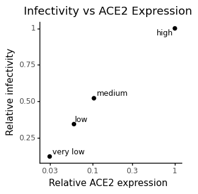
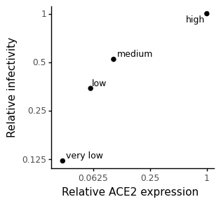
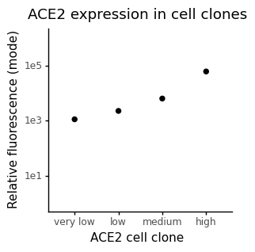

# Plot ACE2 expression vs Infectivity

This notebook plots pseudovirus infectivity in HEK293T clones expressing different levels of ACE2.


```python
import os
import warnings

import pandas as pd
from plotnine import *

import yaml
```


```python
warnings.simplefilter('ignore')
```


```python
with open('config.yaml') as f:
    config = yaml.safe_load(f)
```


```python
resultsdir=config['resultsdir']
os.makedirs(resultsdir, exist_ok=True)
```


```python
df = pd.read_csv(config['ACE2_expression_df'])
df
```


<div>
<style scoped>
    .dataframe tbody tr th:only-of-type {
        vertical-align: middle;
    }

    .dataframe tbody tr th {
        vertical-align: top;
    }

    .dataframe thead th {
        text-align: right;
    }
</style>
<table border="1" class="dataframe">
  <thead>
    <tr style="text-align: right;">
      <th></th>
      <th>cells</th>
      <th>MFI (mode)</th>
      <th>RLU/ul</th>
      <th>relative MFI</th>
      <th>relative RLU/ul</th>
    </tr>
  </thead>
  <tbody>
    <tr>
      <th>0</th>
      <td>high</td>
      <td>60904</td>
      <td>50877.35</td>
      <td>1.000000</td>
      <td>1.000000</td>
    </tr>
    <tr>
      <th>1</th>
      <td>medium</td>
      <td>6344</td>
      <td>39923.31</td>
      <td>0.104164</td>
      <td>0.784697</td>
    </tr>
    <tr>
      <th>2</th>
      <td>low</td>
      <td>2255</td>
      <td>8123.15</td>
      <td>0.037025</td>
      <td>0.159661</td>
    </tr>
    <tr>
      <th>3</th>
      <td>very low</td>
      <td>1119</td>
      <td>1830.92</td>
      <td>0.018373</td>
      <td>0.035987</td>
    </tr>
  </tbody>
</table>
</div>


```python
cat_order = ['very low', 'low', 'medium', 'high']
df['cells'] = pd.Categorical(df['cells'], categories=cat_order, ordered=True)
```


```python
(
    ggplot(df) +
    aes(x="relative MFI", y="relative RLU/ul") +
    geom_point(size=2) +
    geom_text(
        mapping=aes(label='cells'),
        ha='left',
        adjust_text={'expand_points': (1.2, 1.2)},
        size=9
              ) +   
    theme_classic() +
    theme(figure_size=(3,3)) +
    labs(
        title = "Infectivity vs ACE2 Expression",
        x="Relative ACE2 expression",
        y="Relative infectivity") +
    scale_x_log10()
)

```


    

    


    <ggplot: (8775131844837)>


```python
# version with Y axis as log scale
(
    ggplot(df)+
    aes(x="relative MFI", y="relative RLU/ul") +
    geom_point(size=2) +
    geom_text(
        mapping=aes(label='cells'),
        ha='left',
        adjust_text={'expand_points': (1.2, 1.2)},
        size=9
              ) +
    theme_classic()+
    theme(figure_size=(3,3)) +
    labs(
        title = "Infectivity vs ACE2 Expression",
        x="Relative ACE2 expression",
        y="Relative infectivity"
    ) +
    scale_x_log10() +
    scale_y_log10() +
    coord_fixed(ratio = 1)
)

```


    

    


    <ggplot: (8775123312890)>


```python
#ACE2 expression plot for figure 1
(
    ggplot(df)+
    aes(x="cells", y="MFI (mode)") +
    geom_point(size=2) +
    theme_classic()+
    theme(figure_size=(3,3))+
    scale_y_log10(limits=[1,1.1e6])+
    xlab('ACE2 cell clone') +
    scale_y_log10(limits=[1,1.1e6]) +
    labs(y ='Relative fluorescence (mode)',
        title ='ACE2 expression in cell clones')
)
```


    

    


    <ggplot: (8775131908054)>


```python

```


```python

```
