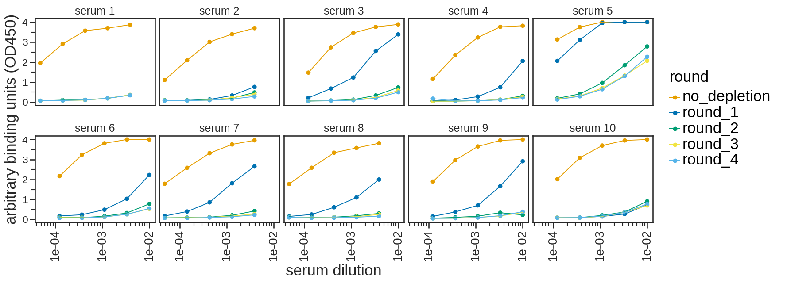
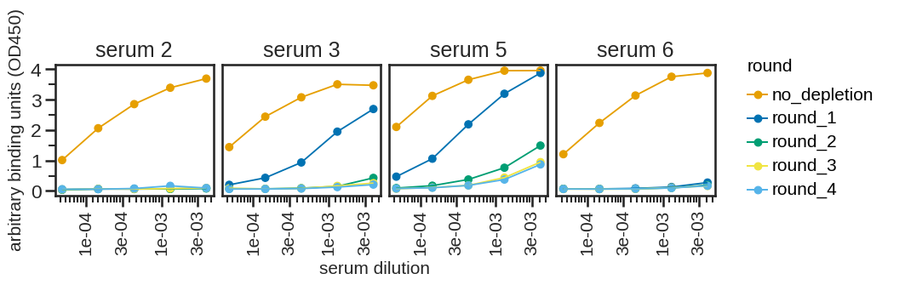

# Analysis and plotting of RBD depletions for sera samles

### Set up Analysis

Import packages.


```python
import itertools
import math
import os
import re
import warnings

from IPython.display import display, HTML

import matplotlib
from matplotlib.backends.backend_pdf import PdfPages
import matplotlib as mpl
import matplotlib.pyplot as plt
from mizani.formatters import scientific_format
import natsort

from neutcurve.colorschemes import CBMARKERS, CBPALETTE

import numpy as np
import pandas as pd
from plotnine import *

import yaml
```


```python
warnings.simplefilter('ignore')
```

Read config file.


```python
with open('config.yaml') as f:
    config = yaml.safe_load(f)
```

Use seaborn theme and change font:


```python
theme_set(theme_seaborn(style='white', context='talk', font_scale=1))
plt.style.use('seaborn-white')
```


```python
resultsdir=config['resultsdir']
os.makedirs(resultsdir, exist_ok=True)
```

## Titration ELISAs for pseudovirus assays

### Read ELISA Titration Data


```python

```


```python
elisa_pv_df_1 = pd.read_csv(config['elisa_pseudovirus_dil1'])

elisa_pv_df_1 = (pd.melt(elisa_pv_df_1, 
                        id_vars=['subject', 'timepoint', 'serum', 'depleted', 'round', 'ligand', 'date'], 
                        var_name='dilution_factor', 
                        value_name='OD450'
                       )
                .assign(dilution_factor=lambda x: x['dilution_factor'].astype(int))
               )

elisa_pv_df_1 = (elisa_pv_df_1
                .assign(depleted= pd.Categorical(elisa_pv_df_1['depleted'], categories=['pre', 'post'], ordered=True),
                        dilution=lambda x: 1/x['dilution_factor'],
               )
                .sort_values('serum', key=lambda x: np.argsort(natsort.index_natsorted(x)))
       )

display(elisa_pv_df_1.head())  # display first few lines
```


<div>
<style scoped>
    .dataframe tbody tr th:only-of-type {
        vertical-align: middle;
    }

    .dataframe tbody tr th {
        vertical-align: top;
    }

    .dataframe thead th {
        text-align: right;
    }
</style>
<table border="1" class="dataframe">
  <thead>
    <tr style="text-align: right;">
      <th></th>
      <th>subject</th>
      <th>timepoint</th>
      <th>serum</th>
      <th>depleted</th>
      <th>round</th>
      <th>ligand</th>
      <th>date</th>
      <th>dilution_factor</th>
      <th>OD450</th>
      <th>dilution</th>
    </tr>
  </thead>
  <tbody>
    <tr>
      <th>0</th>
      <td>99C</td>
      <td>27</td>
      <td>99C-day-27</td>
      <td>pre</td>
      <td>no_depletion</td>
      <td>RBD</td>
      <td>220104</td>
      <td>100</td>
      <td>3.8843</td>
      <td>0.01</td>
    </tr>
    <tr>
      <th>1</th>
      <td>99C</td>
      <td>27</td>
      <td>99C-day-27</td>
      <td>post</td>
      <td>round_1</td>
      <td>RBD</td>
      <td>220104</td>
      <td>100</td>
      <td>3.3874</td>
      <td>0.01</td>
    </tr>
    <tr>
      <th>2</th>
      <td>99C</td>
      <td>27</td>
      <td>99C-day-27</td>
      <td>post</td>
      <td>round_2</td>
      <td>RBD</td>
      <td>220104</td>
      <td>100</td>
      <td>0.7362</td>
      <td>0.01</td>
    </tr>
    <tr>
      <th>3</th>
      <td>99C</td>
      <td>27</td>
      <td>99C-day-27</td>
      <td>post</td>
      <td>round_3</td>
      <td>RBD</td>
      <td>220104</td>
      <td>100</td>
      <td>0.5800</td>
      <td>0.01</td>
    </tr>
    <tr>
      <th>4</th>
      <td>99C</td>
      <td>27</td>
      <td>99C-day-27</td>
      <td>post</td>
      <td>round_4</td>
      <td>RBD</td>
      <td>220104</td>
      <td>100</td>
      <td>0.4996</td>
      <td>0.01</td>
    </tr>
  </tbody>
</table>
</div>


```python

```


```python
elisa_pv_df_2 = pd.read_csv(config['elisa_pseudovirus_dil2'])

elisa_pv_df_2 = (pd.melt(elisa_pv_df_2, 
                        id_vars=['subject', 'timepoint', 'serum', 'depleted', 'round', 'ligand', 'date'], 
                        var_name='dilution_factor', 
                        value_name='OD450'
                       )
                .assign(dilution_factor=lambda x: x['dilution_factor'].astype(int))
               )

elisa_pv_df_2 = (elisa_pv_df_2
                .assign(depleted= pd.Categorical(elisa_pv_df_2['depleted'], categories=['pre', 'post'], ordered=True),
                        dilution=lambda x: 1/x['dilution_factor'],
               )
                .sort_values('serum', key=lambda x: np.argsort(natsort.index_natsorted(x)))
       )

display(elisa_pv_df_2.head())  # display first few lines
```


<div>
<style scoped>
    .dataframe tbody tr th:only-of-type {
        vertical-align: middle;
    }

    .dataframe tbody tr th {
        vertical-align: top;
    }

    .dataframe thead th {
        text-align: right;
    }
</style>
<table border="1" class="dataframe">
  <thead>
    <tr style="text-align: right;">
      <th></th>
      <th>subject</th>
      <th>timepoint</th>
      <th>serum</th>
      <th>depleted</th>
      <th>round</th>
      <th>ligand</th>
      <th>date</th>
      <th>dilution_factor</th>
      <th>OD450</th>
      <th>dilution</th>
    </tr>
  </thead>
  <tbody>
    <tr>
      <th>0</th>
      <td>63C</td>
      <td>10</td>
      <td>63C-day-10</td>
      <td>pre</td>
      <td>no_depletion</td>
      <td>RBD</td>
      <td>220421</td>
      <td>257</td>
      <td>3.8713</td>
      <td>0.003891</td>
    </tr>
    <tr>
      <th>1</th>
      <td>63C</td>
      <td>10</td>
      <td>63C-day-10</td>
      <td>post</td>
      <td>round_1</td>
      <td>RBD</td>
      <td>220421</td>
      <td>257</td>
      <td>NaN</td>
      <td>0.003891</td>
    </tr>
    <tr>
      <th>2</th>
      <td>63C</td>
      <td>10</td>
      <td>63C-day-10</td>
      <td>post</td>
      <td>round_2</td>
      <td>RBD</td>
      <td>220421</td>
      <td>257</td>
      <td>0.3586</td>
      <td>0.003891</td>
    </tr>
    <tr>
      <th>3</th>
      <td>63C</td>
      <td>10</td>
      <td>63C-day-10</td>
      <td>post</td>
      <td>round_3</td>
      <td>RBD</td>
      <td>220421</td>
      <td>257</td>
      <td>0.3615</td>
      <td>0.003891</td>
    </tr>
    <tr>
      <th>4</th>
      <td>63C</td>
      <td>10</td>
      <td>63C-day-10</td>
      <td>post</td>
      <td>round_4</td>
      <td>RBD</td>
      <td>220421</td>
      <td>257</td>
      <td>0.3454</td>
      <td>0.003891</td>
    </tr>
  </tbody>
</table>
</div>


```python
frames = [elisa_pv_df_1,elisa_pv_df_2]
elisa_pv_df = pd.concat(frames)
```


```python
#read in sample info
sample_information = (pd.read_csv(config['sample_information'])
                      .drop_duplicates())

sample_information['sorted']=sample_information['subject_name'].str[:-1].astype(int)
sample_information = sample_information.sort_values('sorted')
sample_information
```


<div>
<style scoped>
    .dataframe tbody tr th:only-of-type {
        vertical-align: middle;
    }

    .dataframe tbody tr th {
        vertical-align: top;
    }

    .dataframe thead th {
        text-align: right;
    }
</style>
<table border="1" class="dataframe">
  <thead>
    <tr style="text-align: right;">
      <th></th>
      <th>day</th>
      <th>age</th>
      <th>vaccine</th>
      <th>subject_name</th>
      <th>serum_org</th>
      <th>gender</th>
      <th>serum</th>
      <th>sorted</th>
    </tr>
  </thead>
  <tbody>
    <tr>
      <th>0</th>
      <td>10</td>
      <td>18-55y</td>
      <td>Pfizer</td>
      <td>63C</td>
      <td>63C-day-10</td>
      <td>Female</td>
      <td>serum 1</td>
      <td>63</td>
    </tr>
    <tr>
      <th>1</th>
      <td>15</td>
      <td>&gt;55y</td>
      <td>Pfizer</td>
      <td>64C</td>
      <td>64C-day-15</td>
      <td>Female</td>
      <td>serum 2</td>
      <td>64</td>
    </tr>
    <tr>
      <th>2</th>
      <td>27</td>
      <td>18-55y</td>
      <td>Pfizer</td>
      <td>99C</td>
      <td>99C-day-27</td>
      <td>Male</td>
      <td>serum 3</td>
      <td>99</td>
    </tr>
    <tr>
      <th>3</th>
      <td>18</td>
      <td>&gt;55y</td>
      <td>Pfizer</td>
      <td>108C</td>
      <td>108C-day-18</td>
      <td>Female</td>
      <td>serum 4</td>
      <td>108</td>
    </tr>
    <tr>
      <th>4</th>
      <td>10</td>
      <td>18-55y</td>
      <td>Pfizer</td>
      <td>120C</td>
      <td>120C-day-10</td>
      <td>Female</td>
      <td>serum 5</td>
      <td>120</td>
    </tr>
    <tr>
      <th>5</th>
      <td>36</td>
      <td>18-55y</td>
      <td>Moderna</td>
      <td>180C</td>
      <td>180C-day-36</td>
      <td>Female</td>
      <td>serum 6</td>
      <td>180</td>
    </tr>
    <tr>
      <th>6</th>
      <td>9</td>
      <td>&gt;55y</td>
      <td>Pfizer</td>
      <td>192C</td>
      <td>192C-day-9</td>
      <td>Female</td>
      <td>serum 7</td>
      <td>192</td>
    </tr>
    <tr>
      <th>7</th>
      <td>8</td>
      <td>18-55y</td>
      <td>Pfizer</td>
      <td>194C</td>
      <td>194C-day-8</td>
      <td>Male</td>
      <td>serum 8</td>
      <td>194</td>
    </tr>
    <tr>
      <th>8</th>
      <td>19</td>
      <td>18-55y</td>
      <td>Pfizer</td>
      <td>215C</td>
      <td>215C-day-19</td>
      <td>Male</td>
      <td>serum 9</td>
      <td>215</td>
    </tr>
    <tr>
      <th>9</th>
      <td>29</td>
      <td>18-55y</td>
      <td>Pfizer</td>
      <td>229C</td>
      <td>229C-day-29</td>
      <td>Female</td>
      <td>serum 10</td>
      <td>229</td>
    </tr>
  </tbody>
</table>
</div>


```python
elisa_pv_df = pd.merge(elisa_pv_df, sample_information,
                    left_on='serum', right_on='serum_org')
elisa_pv_df.drop('serum_x', axis=1, inplace=True)
elisa_pv_df = elisa_pv_df.rename(columns={"serum_y": "serum"}, errors="raise")
elisa_pv_df
```


<div>
<style scoped>
    .dataframe tbody tr th:only-of-type {
        vertical-align: middle;
    }

    .dataframe tbody tr th {
        vertical-align: top;
    }

    .dataframe thead th {
        text-align: right;
    }
</style>
<table border="1" class="dataframe">
  <thead>
    <tr style="text-align: right;">
      <th></th>
      <th>subject</th>
      <th>timepoint</th>
      <th>depleted</th>
      <th>round</th>
      <th>ligand</th>
      <th>date</th>
      <th>dilution_factor</th>
      <th>OD450</th>
      <th>dilution</th>
      <th>day</th>
      <th>age</th>
      <th>vaccine</th>
      <th>subject_name</th>
      <th>serum_org</th>
      <th>gender</th>
      <th>serum</th>
      <th>sorted</th>
    </tr>
  </thead>
  <tbody>
    <tr>
      <th>0</th>
      <td>99C</td>
      <td>27</td>
      <td>pre</td>
      <td>no_depletion</td>
      <td>RBD</td>
      <td>220104</td>
      <td>100</td>
      <td>3.8843</td>
      <td>0.010000</td>
      <td>27</td>
      <td>18-55y</td>
      <td>Pfizer</td>
      <td>99C</td>
      <td>99C-day-27</td>
      <td>Male</td>
      <td>serum 3</td>
      <td>99</td>
    </tr>
    <tr>
      <th>1</th>
      <td>99C</td>
      <td>27</td>
      <td>post</td>
      <td>round_1</td>
      <td>RBD</td>
      <td>220104</td>
      <td>100</td>
      <td>3.3874</td>
      <td>0.010000</td>
      <td>27</td>
      <td>18-55y</td>
      <td>Pfizer</td>
      <td>99C</td>
      <td>99C-day-27</td>
      <td>Male</td>
      <td>serum 3</td>
      <td>99</td>
    </tr>
    <tr>
      <th>2</th>
      <td>99C</td>
      <td>27</td>
      <td>post</td>
      <td>round_2</td>
      <td>RBD</td>
      <td>220104</td>
      <td>100</td>
      <td>0.7362</td>
      <td>0.010000</td>
      <td>27</td>
      <td>18-55y</td>
      <td>Pfizer</td>
      <td>99C</td>
      <td>99C-day-27</td>
      <td>Male</td>
      <td>serum 3</td>
      <td>99</td>
    </tr>
    <tr>
      <th>3</th>
      <td>99C</td>
      <td>27</td>
      <td>post</td>
      <td>round_3</td>
      <td>RBD</td>
      <td>220104</td>
      <td>100</td>
      <td>0.5800</td>
      <td>0.010000</td>
      <td>27</td>
      <td>18-55y</td>
      <td>Pfizer</td>
      <td>99C</td>
      <td>99C-day-27</td>
      <td>Male</td>
      <td>serum 3</td>
      <td>99</td>
    </tr>
    <tr>
      <th>4</th>
      <td>99C</td>
      <td>27</td>
      <td>post</td>
      <td>round_4</td>
      <td>RBD</td>
      <td>220104</td>
      <td>100</td>
      <td>0.4996</td>
      <td>0.010000</td>
      <td>27</td>
      <td>18-55y</td>
      <td>Pfizer</td>
      <td>99C</td>
      <td>99C-day-27</td>
      <td>Male</td>
      <td>serum 3</td>
      <td>99</td>
    </tr>
    <tr>
      <th>...</th>
      <td>...</td>
      <td>...</td>
      <td>...</td>
      <td>...</td>
      <td>...</td>
      <td>...</td>
      <td>...</td>
      <td>...</td>
      <td>...</td>
      <td>...</td>
      <td>...</td>
      <td>...</td>
      <td>...</td>
      <td>...</td>
      <td>...</td>
      <td>...</td>
      <td>...</td>
    </tr>
    <tr>
      <th>245</th>
      <td>194C</td>
      <td>8</td>
      <td>pre</td>
      <td>no_depletion</td>
      <td>RBD</td>
      <td>220421</td>
      <td>20827</td>
      <td>1.7747</td>
      <td>0.000048</td>
      <td>8</td>
      <td>18-55y</td>
      <td>Pfizer</td>
      <td>194C</td>
      <td>194C-day-8</td>
      <td>Male</td>
      <td>serum 8</td>
      <td>194</td>
    </tr>
    <tr>
      <th>246</th>
      <td>194C</td>
      <td>8</td>
      <td>post</td>
      <td>round_1</td>
      <td>RBD</td>
      <td>220421</td>
      <td>20827</td>
      <td>0.1556</td>
      <td>0.000048</td>
      <td>8</td>
      <td>18-55y</td>
      <td>Pfizer</td>
      <td>194C</td>
      <td>194C-day-8</td>
      <td>Male</td>
      <td>serum 8</td>
      <td>194</td>
    </tr>
    <tr>
      <th>247</th>
      <td>194C</td>
      <td>8</td>
      <td>post</td>
      <td>round_2</td>
      <td>RBD</td>
      <td>220421</td>
      <td>20827</td>
      <td>0.1293</td>
      <td>0.000048</td>
      <td>8</td>
      <td>18-55y</td>
      <td>Pfizer</td>
      <td>194C</td>
      <td>194C-day-8</td>
      <td>Male</td>
      <td>serum 8</td>
      <td>194</td>
    </tr>
    <tr>
      <th>248</th>
      <td>194C</td>
      <td>8</td>
      <td>post</td>
      <td>round_3</td>
      <td>RBD</td>
      <td>220421</td>
      <td>20827</td>
      <td>0.1069</td>
      <td>0.000048</td>
      <td>8</td>
      <td>18-55y</td>
      <td>Pfizer</td>
      <td>194C</td>
      <td>194C-day-8</td>
      <td>Male</td>
      <td>serum 8</td>
      <td>194</td>
    </tr>
    <tr>
      <th>249</th>
      <td>194C</td>
      <td>8</td>
      <td>post</td>
      <td>round_4</td>
      <td>RBD</td>
      <td>220421</td>
      <td>20827</td>
      <td>0.1034</td>
      <td>0.000048</td>
      <td>8</td>
      <td>18-55y</td>
      <td>Pfizer</td>
      <td>194C</td>
      <td>194C-day-8</td>
      <td>Male</td>
      <td>serum 8</td>
      <td>194</td>
    </tr>
  </tbody>
</table>
<p>250 rows × 17 columns</p>
</div>


```python
nconditions = elisa_pv_df['serum'].nunique()
ncol = np.minimum(6, nconditions)
nrow = math.ceil(nconditions / ncol)

colours = ('#E69F00','#0072B2','#009E73','#F0E442','#56B4E9',)

p = (
    ggplot((elisa_pv_df
            .assign(serum=lambda x: pd.Categorical(x['serum'], 
                                                   natsort.natsorted(x['serum'].unique()), 
                                                   ordered=True))
           ),
           aes('dilution', 
               'OD450', 
               color='round'
              )) +
    geom_point(size=3) +
    geom_path(aes(color='round'), size=0.75) +
    scale_x_log10(name='serum dilution', labels=scientific_format(digits=0)) +
    facet_wrap('~ serum', ncol=5) +
    theme(figure_size=(3 * ncol, 3 * nrow),
          axis_text_x=element_text(size=20,angle=90),
          subplots_adjust={'hspace':0.35},
          strip_background_x=element_blank(),
          legend_text=element_text(size=25),
          legend_title=element_text(size=25),
          axis_title_x=element_text(size=25),
          axis_title_y=element_text(size=25)
         ) +
    scale_color_manual(values=colours) +
    scale_shape_manual(values=['o', 'x']) +
    ylab('arbitrary binding units (OD450)')
    )


_ = p.draw()
```


    

    


### ELISA for Live Virus RBD depletions


```python
elisa_lv_df = pd.read_csv(config['elisa_livevirus'])

elisa_lv_df = (pd.melt(elisa_lv_df, 
                        id_vars=['subject', 'timepoint', 'serum', 'depleted', 'round', 'ligand', 'date'], 
                        var_name='dilution_factor', 
                        value_name='OD450'
                       )
                .assign(dilution_factor=lambda x: x['dilution_factor'].astype(int))
               )

elisa_lv_df = (elisa_lv_df
                .assign(depleted= pd.Categorical(elisa_lv_df['depleted'], categories=['pre', 'post'], ordered=True),
                        dilution=lambda x: 1/x['dilution_factor'],
               )
                .sort_values('serum', key=lambda x: np.argsort(natsort.index_natsorted(x)))
       )

display(elisa_lv_df.head())  # display first few lines
```


<div>
<style scoped>
    .dataframe tbody tr th:only-of-type {
        vertical-align: middle;
    }

    .dataframe tbody tr th {
        vertical-align: top;
    }

    .dataframe thead th {
        text-align: right;
    }
</style>
<table border="1" class="dataframe">
  <thead>
    <tr style="text-align: right;">
      <th></th>
      <th>subject</th>
      <th>timepoint</th>
      <th>serum</th>
      <th>depleted</th>
      <th>round</th>
      <th>ligand</th>
      <th>date</th>
      <th>dilution_factor</th>
      <th>OD450</th>
      <th>dilution</th>
    </tr>
  </thead>
  <tbody>
    <tr>
      <th>0</th>
      <td>64C</td>
      <td>15</td>
      <td>64C-day-15</td>
      <td>pre</td>
      <td>no_depletion</td>
      <td>RBD</td>
      <td>220421</td>
      <td>257</td>
      <td>3.6872</td>
      <td>0.003891</td>
    </tr>
    <tr>
      <th>1</th>
      <td>64C</td>
      <td>15</td>
      <td>64C-day-15</td>
      <td>post</td>
      <td>round_1</td>
      <td>RBD</td>
      <td>220421</td>
      <td>257</td>
      <td>0.0919</td>
      <td>0.003891</td>
    </tr>
    <tr>
      <th>2</th>
      <td>64C</td>
      <td>15</td>
      <td>64C-day-15</td>
      <td>post</td>
      <td>round_2</td>
      <td>RBD</td>
      <td>220421</td>
      <td>257</td>
      <td>0.0821</td>
      <td>0.003891</td>
    </tr>
    <tr>
      <th>3</th>
      <td>64C</td>
      <td>15</td>
      <td>64C-day-15</td>
      <td>post</td>
      <td>round_3</td>
      <td>RBD</td>
      <td>220421</td>
      <td>257</td>
      <td>0.0968</td>
      <td>0.003891</td>
    </tr>
    <tr>
      <th>4</th>
      <td>64C</td>
      <td>15</td>
      <td>64C-day-15</td>
      <td>post</td>
      <td>round_4</td>
      <td>RBD</td>
      <td>220421</td>
      <td>257</td>
      <td>0.0961</td>
      <td>0.003891</td>
    </tr>
  </tbody>
</table>
</div>


```python
elisa_lv_df = pd.merge(elisa_lv_df, sample_information,
                    left_on='serum', right_on='serum_org')

elisa_lv_df
elisa_lv_df.drop('serum_x', axis=1, inplace=True)
elisa_lv_df = elisa_lv_df.rename(columns={"serum_y": "serum"}, errors="raise")
elisa_lv_df
```


<div>
<style scoped>
    .dataframe tbody tr th:only-of-type {
        vertical-align: middle;
    }

    .dataframe tbody tr th {
        vertical-align: top;
    }

    .dataframe thead th {
        text-align: right;
    }
</style>
<table border="1" class="dataframe">
  <thead>
    <tr style="text-align: right;">
      <th></th>
      <th>subject</th>
      <th>timepoint</th>
      <th>depleted</th>
      <th>round</th>
      <th>ligand</th>
      <th>date</th>
      <th>dilution_factor</th>
      <th>OD450</th>
      <th>dilution</th>
      <th>day</th>
      <th>age</th>
      <th>vaccine</th>
      <th>subject_name</th>
      <th>serum_org</th>
      <th>gender</th>
      <th>serum</th>
      <th>sorted</th>
    </tr>
  </thead>
  <tbody>
    <tr>
      <th>0</th>
      <td>64C</td>
      <td>15</td>
      <td>pre</td>
      <td>no_depletion</td>
      <td>RBD</td>
      <td>220421</td>
      <td>257</td>
      <td>3.6872</td>
      <td>0.003891</td>
      <td>15</td>
      <td>&gt;55y</td>
      <td>Pfizer</td>
      <td>64C</td>
      <td>64C-day-15</td>
      <td>Female</td>
      <td>serum 2</td>
      <td>64</td>
    </tr>
    <tr>
      <th>1</th>
      <td>64C</td>
      <td>15</td>
      <td>post</td>
      <td>round_1</td>
      <td>RBD</td>
      <td>220421</td>
      <td>257</td>
      <td>0.0919</td>
      <td>0.003891</td>
      <td>15</td>
      <td>&gt;55y</td>
      <td>Pfizer</td>
      <td>64C</td>
      <td>64C-day-15</td>
      <td>Female</td>
      <td>serum 2</td>
      <td>64</td>
    </tr>
    <tr>
      <th>2</th>
      <td>64C</td>
      <td>15</td>
      <td>post</td>
      <td>round_2</td>
      <td>RBD</td>
      <td>220421</td>
      <td>257</td>
      <td>0.0821</td>
      <td>0.003891</td>
      <td>15</td>
      <td>&gt;55y</td>
      <td>Pfizer</td>
      <td>64C</td>
      <td>64C-day-15</td>
      <td>Female</td>
      <td>serum 2</td>
      <td>64</td>
    </tr>
    <tr>
      <th>3</th>
      <td>64C</td>
      <td>15</td>
      <td>post</td>
      <td>round_3</td>
      <td>RBD</td>
      <td>220421</td>
      <td>257</td>
      <td>0.0968</td>
      <td>0.003891</td>
      <td>15</td>
      <td>&gt;55y</td>
      <td>Pfizer</td>
      <td>64C</td>
      <td>64C-day-15</td>
      <td>Female</td>
      <td>serum 2</td>
      <td>64</td>
    </tr>
    <tr>
      <th>4</th>
      <td>64C</td>
      <td>15</td>
      <td>post</td>
      <td>round_4</td>
      <td>RBD</td>
      <td>220421</td>
      <td>257</td>
      <td>0.0961</td>
      <td>0.003891</td>
      <td>15</td>
      <td>&gt;55y</td>
      <td>Pfizer</td>
      <td>64C</td>
      <td>64C-day-15</td>
      <td>Female</td>
      <td>serum 2</td>
      <td>64</td>
    </tr>
    <tr>
      <th>...</th>
      <td>...</td>
      <td>...</td>
      <td>...</td>
      <td>...</td>
      <td>...</td>
      <td>...</td>
      <td>...</td>
      <td>...</td>
      <td>...</td>
      <td>...</td>
      <td>...</td>
      <td>...</td>
      <td>...</td>
      <td>...</td>
      <td>...</td>
      <td>...</td>
      <td>...</td>
    </tr>
    <tr>
      <th>95</th>
      <td>180C</td>
      <td>36</td>
      <td>pre</td>
      <td>no_depletion</td>
      <td>RBD</td>
      <td>220421</td>
      <td>20817</td>
      <td>1.2065</td>
      <td>0.000048</td>
      <td>36</td>
      <td>18-55y</td>
      <td>Moderna</td>
      <td>180C</td>
      <td>180C-day-36</td>
      <td>Female</td>
      <td>serum 6</td>
      <td>180</td>
    </tr>
    <tr>
      <th>96</th>
      <td>180C</td>
      <td>36</td>
      <td>post</td>
      <td>round_1</td>
      <td>RBD</td>
      <td>220421</td>
      <td>20817</td>
      <td>0.0704</td>
      <td>0.000048</td>
      <td>36</td>
      <td>18-55y</td>
      <td>Moderna</td>
      <td>180C</td>
      <td>180C-day-36</td>
      <td>Female</td>
      <td>serum 6</td>
      <td>180</td>
    </tr>
    <tr>
      <th>97</th>
      <td>180C</td>
      <td>36</td>
      <td>post</td>
      <td>round_2</td>
      <td>RBD</td>
      <td>220421</td>
      <td>20817</td>
      <td>0.0684</td>
      <td>0.000048</td>
      <td>36</td>
      <td>18-55y</td>
      <td>Moderna</td>
      <td>180C</td>
      <td>180C-day-36</td>
      <td>Female</td>
      <td>serum 6</td>
      <td>180</td>
    </tr>
    <tr>
      <th>98</th>
      <td>180C</td>
      <td>36</td>
      <td>post</td>
      <td>round_3</td>
      <td>RBD</td>
      <td>220421</td>
      <td>20817</td>
      <td>0.0625</td>
      <td>0.000048</td>
      <td>36</td>
      <td>18-55y</td>
      <td>Moderna</td>
      <td>180C</td>
      <td>180C-day-36</td>
      <td>Female</td>
      <td>serum 6</td>
      <td>180</td>
    </tr>
    <tr>
      <th>99</th>
      <td>180C</td>
      <td>36</td>
      <td>post</td>
      <td>round_4</td>
      <td>RBD</td>
      <td>220421</td>
      <td>20817</td>
      <td>0.0645</td>
      <td>0.000048</td>
      <td>36</td>
      <td>18-55y</td>
      <td>Moderna</td>
      <td>180C</td>
      <td>180C-day-36</td>
      <td>Female</td>
      <td>serum 6</td>
      <td>180</td>
    </tr>
  </tbody>
</table>
<p>100 rows × 17 columns</p>
</div>


```python
nconditions = elisa_pv_df['serum'].nunique()
ncol = np.minimum(6, nconditions)
nrow = math.ceil(nconditions / ncol)

colours = ('#E69F00','#0072B2','#009E73','#F0E442','#56B4E9',)

p = (
    ggplot((elisa_lv_df
            .assign(serum=lambda x: pd.Categorical(x['serum'], 
                                                   natsort.natsorted(x['serum'].unique()), 
                                                   ordered=True))
           ),
           aes('dilution', 
               'OD450', 
               color='round'
              )) +
    geom_point(size=3) +
    geom_path(aes(color='round'), size=0.75) +
    scale_x_log10(name='serum dilution', labels=scientific_format(digits=0)) +
    facet_wrap('~ serum', ncol=5) +
    theme(figure_size=(10,2),
          axis_text_x=element_text(size=15,angle=90),
          subplots_adjust={'hspace':0.35},
          strip_background_x=element_blank(),
          legend_text=element_text(size=15),
          legend_title=element_text(size=15),
          axis_title_x=element_text(size=15),
          axis_title_y=element_text(size=15)
         ) +
    scale_color_manual(values=colours) +
    scale_shape_manual(values=['o', 'x']) +
    ylab('arbitrary binding units (OD450)')
    )


_ = p.draw()
```


    

    

