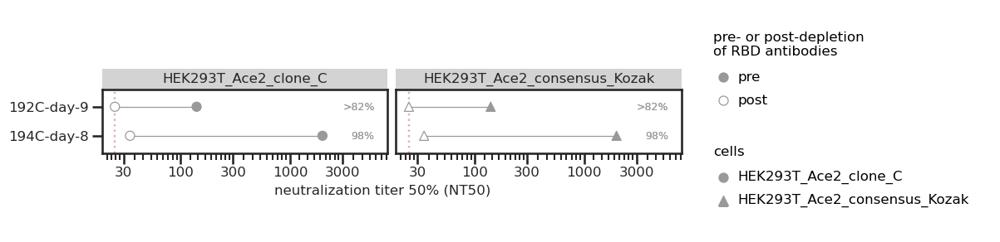
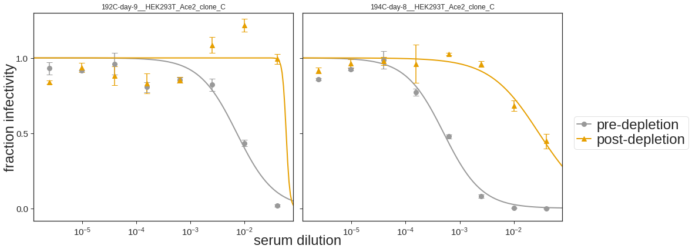

# Analysis of neutalisation in different Ace2 clones

### Set up Analysis

Import packages.


```python
import itertools
import math
import os
import re
import warnings

from IPython.display import display, HTML

import matplotlib
from matplotlib.backends.backend_pdf import PdfPages
import matplotlib as mpl
import matplotlib.pyplot as plt
from mizani.formatters import scientific_format
import natsort

import numpy as np
import pandas as pd
from plotnine import *
import seaborn

import neutcurve
from neutcurve.colorschemes import CBMARKERS, CBPALETTE

import sklearn
import scipy.stats

import yaml
```


```python
warnings.simplefilter('ignore')
```

Read config file.


```python
with open('config.yaml') as f:
    config = yaml.safe_load(f)
```

Use seaborn theme and change font:


```python
theme_set(theme_seaborn(style='white', context='talk', font='FreeSans', font_scale=1))
plt.style.use('seaborn-white')
```


```python
resultsdir=config['resultsdir']
os.makedirs(resultsdir, exist_ok=True)
```


```python
pd.options.display.max_rows = 100
```

## Read in data


```python
sample_information = (pd.read_csv(config['sample_information'])
                      .drop_duplicates()
                     )

frac_infect = list() # create df list

for f in config['depletion_neuts'].keys():
    df = (pd.read_csv(f, index_col=0).assign(cells=config['depletion_neuts'][f]))
    df = df.merge(sample_information, on='serum')
    frac_infect.append(df)  
    
```


```python
for df in frac_infect:
    df['serum'] = df['serum'] + '__' + df['cells']
```

## Fit Hill curve to data using [`neutcurve`](https://jbloomlab.github.io/neutcurve/)


```python
frac_infect_combined = list()

for cells in frac_infect:
    fits = neutcurve.CurveFits(cells)
    frac_infect_combined.append(fits)
```


```python
fitparams_combined = pd.DataFrame() # create empty data frame

for fits in frac_infect_combined:
    fitparams = (
        fits.fitParams()
        .rename(columns={'virus': 'depletion'})
        # get columns of interest
        [['serum', 'depletion', 'ic50', 'ic50_bound']]
        .assign(NT50=lambda x: 1/x['ic50'])
#         .merge(sample_information, on=['serum'])
        
        )
    fitparams_combined = fitparams_combined.append(fitparams).reset_index(drop=True)
    

fitparams_combined['ic50_is_bound'] = fitparams_combined['ic50_bound'].apply(lambda x: True if x!='interpolated' else False)

fitparams_combined.head(10)

```


<div>
<style scoped>
    .dataframe tbody tr th:only-of-type {
        vertical-align: middle;
    }

    .dataframe tbody tr th {
        vertical-align: top;
    }

    .dataframe thead th {
        text-align: right;
    }
</style>
<table border="1" class="dataframe">
  <thead>
    <tr style="text-align: right;">
      <th></th>
      <th>serum</th>
      <th>depletion</th>
      <th>ic50</th>
      <th>ic50_bound</th>
      <th>NT50</th>
      <th>ic50_is_bound</th>
    </tr>
  </thead>
  <tbody>
    <tr>
      <th>0</th>
      <td>192C-day-9__HEK293T_Ace2_consensus_Kozak</td>
      <td>pre-depletion</td>
      <td>0.007157</td>
      <td>interpolated</td>
      <td>139.722571</td>
      <td>False</td>
    </tr>
    <tr>
      <th>1</th>
      <td>192C-day-9__HEK293T_Ace2_consensus_Kozak</td>
      <td>post-depletion</td>
      <td>0.040000</td>
      <td>lower</td>
      <td>25.000000</td>
      <td>True</td>
    </tr>
    <tr>
      <th>2</th>
      <td>194C-day-8__HEK293T_Ace2_consensus_Kozak</td>
      <td>pre-depletion</td>
      <td>0.000506</td>
      <td>interpolated</td>
      <td>1976.592157</td>
      <td>False</td>
    </tr>
    <tr>
      <th>3</th>
      <td>194C-day-8__HEK293T_Ace2_consensus_Kozak</td>
      <td>post-depletion</td>
      <td>0.029077</td>
      <td>interpolated</td>
      <td>34.391149</td>
      <td>False</td>
    </tr>
    <tr>
      <th>4</th>
      <td>192C-day-9__HEK293T_Ace2_clone_C</td>
      <td>pre-depletion</td>
      <td>0.007157</td>
      <td>interpolated</td>
      <td>139.722571</td>
      <td>False</td>
    </tr>
    <tr>
      <th>5</th>
      <td>192C-day-9__HEK293T_Ace2_clone_C</td>
      <td>post-depletion</td>
      <td>0.040000</td>
      <td>lower</td>
      <td>25.000000</td>
      <td>True</td>
    </tr>
    <tr>
      <th>6</th>
      <td>194C-day-8__HEK293T_Ace2_clone_C</td>
      <td>pre-depletion</td>
      <td>0.000506</td>
      <td>interpolated</td>
      <td>1976.592157</td>
      <td>False</td>
    </tr>
    <tr>
      <th>7</th>
      <td>194C-day-8__HEK293T_Ace2_clone_C</td>
      <td>post-depletion</td>
      <td>0.029077</td>
      <td>interpolated</td>
      <td>34.391149</td>
      <td>False</td>
    </tr>
  </tbody>
</table>
</div>


## Make horizontal line plot connecting pre- and post-IC50
* Order with greatest fold-change at the top
* Put labels on far right with the % of neutralizing activity targeting the RBD (percent_RBD = 1-(1/foldchange))
* color by pre vs post
* vertical line for limit of detection


```python
foldchange = (
    fitparams_combined
    .pivot_table(values='ic50', index=['serum'], columns=['depletion'])
    .reset_index()
    .rename(columns={'post-depletion': 'post-depletion_ic50', 'pre-depletion': 'pre-depletion_ic50'})
    .assign(fold_change=lambda x: x['post-depletion_ic50'] / x['pre-depletion_ic50'],
            percent_RBD= lambda x: ((1-1/x['fold_change'])*100).astype(int),
            NT50_pre=lambda x: 1/x['pre-depletion_ic50'],
            NT50_post=lambda x: 1/x['post-depletion_ic50'],
           )
    .merge(fitparams_combined.query('depletion=="post-depletion"')[['serum', 'ic50_is_bound']], on='serum')
    .assign(perc_RBD_str = lambda x: x['percent_RBD'].astype(str)
           )
    .rename(columns={'ic50_is_bound': 'post_ic50_bound'})
    .merge(fitparams_combined)
    )

foldchange['perc_RBD_str'] = np.where(foldchange['post_ic50_bound'], '>'+foldchange['perc_RBD_str']+'%', foldchange['perc_RBD_str']+'%')
foldchange.head(2)
```


<div>
<style scoped>
    .dataframe tbody tr th:only-of-type {
        vertical-align: middle;
    }

    .dataframe tbody tr th {
        vertical-align: top;
    }

    .dataframe thead th {
        text-align: right;
    }
</style>
<table border="1" class="dataframe">
  <thead>
    <tr style="text-align: right;">
      <th></th>
      <th>serum</th>
      <th>post-depletion_ic50</th>
      <th>pre-depletion_ic50</th>
      <th>fold_change</th>
      <th>percent_RBD</th>
      <th>NT50_pre</th>
      <th>NT50_post</th>
      <th>post_ic50_bound</th>
      <th>perc_RBD_str</th>
      <th>depletion</th>
      <th>ic50</th>
      <th>ic50_bound</th>
      <th>NT50</th>
      <th>ic50_is_bound</th>
    </tr>
  </thead>
  <tbody>
    <tr>
      <th>0</th>
      <td>192C-day-9__HEK293T_Ace2_clone_C</td>
      <td>0.04</td>
      <td>0.007157</td>
      <td>5.588903</td>
      <td>82</td>
      <td>139.722571</td>
      <td>25.0</td>
      <td>True</td>
      <td>&gt;82%</td>
      <td>pre-depletion</td>
      <td>0.007157</td>
      <td>interpolated</td>
      <td>139.722571</td>
      <td>False</td>
    </tr>
    <tr>
      <th>1</th>
      <td>192C-day-9__HEK293T_Ace2_clone_C</td>
      <td>0.04</td>
      <td>0.007157</td>
      <td>5.588903</td>
      <td>82</td>
      <td>139.722571</td>
      <td>25.0</td>
      <td>True</td>
      <td>&gt;82%</td>
      <td>post-depletion</td>
      <td>0.040000</td>
      <td>lower</td>
      <td>25.000000</td>
      <td>True</td>
    </tr>
  </tbody>
</table>
</div>


### Plot fold-change NT50 pre- and post-RBD antibody depletion for the serum samples only 


```python
df=(foldchange
      .replace({'pre-depletion': 'pre', 'post-depletion': 'post'})
     )
df['fill_color'] = 'pre-depletion'
df['fill_color'] = np.where(df['depletion'] == 'post', 'post-depletion', df['fill_color'])

df['depletion']=pd.Categorical(df['depletion'], categories=['pre', 'post'], ordered=True)
```


```python
df[['serum','cells']] = df["serum"].str.split("__", n = 1, expand = True)
```


```python
p = (ggplot(df
            .assign(
                    serum=lambda x: pd.Categorical(x['serum'], natsort.natsorted(x['serum'].unique())[::-1], ordered=True)
                   )
            , 
            aes(x='NT50',
                y='serum',
                fill='depletion',
                group='serum',
                shape='cells',
                label='perc_RBD_str'
               )) +
     scale_x_log10(name='neutralization titer 50% (NT50)', 
                   limits=[config['NT50_LOD'],df['NT50'].max()*3]) +
     geom_vline(xintercept=config['NT50_LOD'], 
                linetype='dotted', 
                size=1, 
                alpha=0.6, 
                color=CBPALETTE[7]) +
     geom_line(alpha=1, color=CBPALETTE[0]) +
     geom_point(size=4, color=CBPALETTE[0]) +
     geom_text(aes(x=df['NT50'].max()*3, y='serum'),
               color=CBPALETTE[0],
               ha='right',
               size=9,
              ) +
     theme(figure_size=(9,0.5*df['serum'].nunique()),
           axis_text=element_text(size=12),
           legend_text=element_text(size=12),
           legend_title=element_text(size=12),
           axis_title_x=element_text(size=12),
           strip_text = element_text(size=12)
          ) +
     facet_wrap('cells') +
     ylab('') +
     scale_fill_manual(values=['#999999', '#FFFFFF', ], 
                       name='pre- or post-depletion\nof RBD antibodies')
    )

_ = p.draw()


p.save(f'{resultsdir}/NT50_lineplot_nocolors.pdf')
```

    findfont: Font family ['FreeSans'] not found. Falling back to DejaVu Sans.
    findfont: Font family ['FreeSans'] not found. Falling back to DejaVu Sans.
    findfont: Font family ['FreeSans'] not found. Falling back to DejaVu Sans.
    findfont: Font family ['FreeSans'] not found. Falling back to DejaVu Sans.


    

    


## Plot neut curves for all samples


```python
for fits in frac_infect_combined:
    fig, axes = fits.plotSera(
                              xlabel='serum dilution',
                              ncol=6,
                              widthscale=2,
                              heightscale=2,
                              titlesize=12, labelsize=24, ticksize=15, legendfontsize=24, yticklocs=[0,0.5,1],
                              markersize=8, linewidth=2,
                             )

    plotfile = PdfPages(f'{resultsdir}/{fits}_sera_frac_infectivity.pdf')
    plotfile.savefig(bbox_inches='tight', transparent=True)
    plotfile.close()
```


    

    


    

    


```python

```
