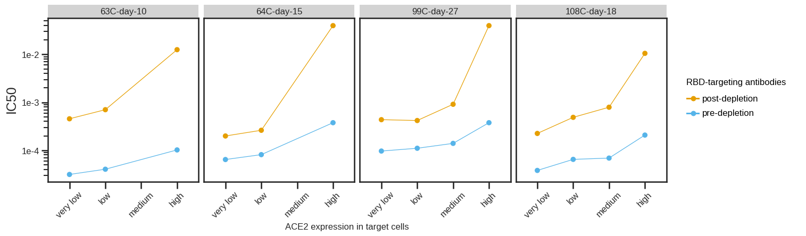
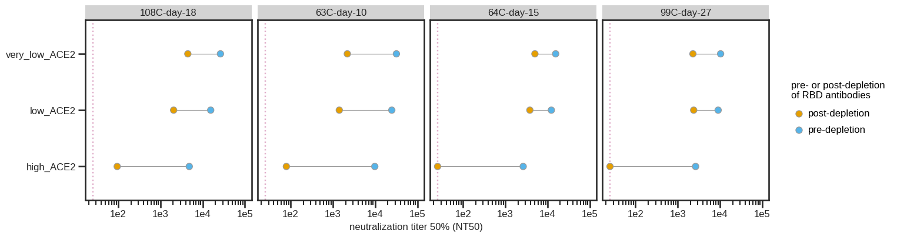
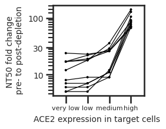

# Analysis of SARS-COV-2 virus neutalization in different Ace2 clones

### Set up Analysis


```python
import itertools
import math
import os
import re
import warnings

from IPython.display import display, HTML

import matplotlib
import matplotlib as mpl
import matplotlib.pyplot as plt
import natsort

import numpy as np
import pandas as pd
from plotnine import *
import seaborn

import neutcurve
from neutcurve.colorschemes import CBMARKERS, CBPALETTE

import yaml
```


```python
warnings.simplefilter('ignore')
```

Read config file.


```python
with open('config.yaml') as f:
    config = yaml.safe_load(f)
```

Set seaborn theme:


```python
theme_set(theme_seaborn(style='white', context='talk', font_scale=1))
plt.style.use('seaborn-white')
```


```python
resultsdir=config['resultsdir']
os.makedirs(resultsdir, exist_ok=True)
```

## Read in data


```python
sample_information = (pd.read_csv(config['sample_information'])
                      .drop_duplicates()
                     )

frac_infect = list() # create df list

for f in config['depletion_neuts'].keys():
    df = (pd.read_csv(f, index_col=0).assign(cells=config['depletion_neuts'][f]))
    df = df.merge(sample_information, on='serum')
    frac_infect.append(df)  

```


```python
for df in frac_infect:
    df['serum'] = df['serum'] + '__' + df['cells']
```


```python
sample_information
```


<div>
<style scoped>
    .dataframe tbody tr th:only-of-type {
        vertical-align: middle;
    }

    .dataframe tbody tr th {
        vertical-align: top;
    }

    .dataframe thead th {
        text-align: right;
    }
</style>
<table border="1" class="dataframe">
  <thead>
    <tr style="text-align: right;">
      <th></th>
      <th>day</th>
      <th>age</th>
      <th>vaccine</th>
      <th>subject_name</th>
      <th>serum</th>
      <th>gender</th>
    </tr>
  </thead>
  <tbody>
    <tr>
      <th>0</th>
      <td>9</td>
      <td>18-55y</td>
      <td>Pfizer</td>
      <td>192C</td>
      <td>192C-day-9</td>
      <td>Female</td>
    </tr>
    <tr>
      <th>1</th>
      <td>8</td>
      <td>18-55y</td>
      <td>Pfizer</td>
      <td>194C</td>
      <td>194C-day-8</td>
      <td>Male</td>
    </tr>
    <tr>
      <th>2</th>
      <td>10</td>
      <td>18-55y</td>
      <td>Pfizer</td>
      <td>63C</td>
      <td>63C-day-10</td>
      <td>Female</td>
    </tr>
    <tr>
      <th>3</th>
      <td>15</td>
      <td>&gt;55y</td>
      <td>Pfizer</td>
      <td>64C</td>
      <td>64C-day-15</td>
      <td>Female</td>
    </tr>
    <tr>
      <th>4</th>
      <td>27</td>
      <td>18-55y</td>
      <td>Pfizer</td>
      <td>99C</td>
      <td>99C-day-27</td>
      <td>Male</td>
    </tr>
    <tr>
      <th>5</th>
      <td>18</td>
      <td>&gt;55y</td>
      <td>Pfizer</td>
      <td>108C</td>
      <td>108C-day-18</td>
      <td>Female</td>
    </tr>
  </tbody>
</table>
</div>


## Fit Hill curve to data using [`neutcurve`](https://jbloomlab.github.io/neutcurve/)


```python
frac_infect_combined = list()

for cells in frac_infect:
    fits = neutcurve.CurveFits(cells, fixbottom= False)
    frac_infect_combined.append(fits)
```


```python
fitparams_combined = pd.DataFrame() # create empty data frame

for fits in frac_infect_combined:
    fitparams = (
        fits.fitParams()
        .rename(columns={'virus': 'depletion'})
        # get columns of interest
        [['serum', 'depletion', 'ic50', 'ic50_bound']]
        .assign(NT50=lambda x: 1/x['ic50'])
#         .merge(sample_information, on=['serum'])
        
        )
    fitparams_combined = fitparams_combined.append(fitparams).reset_index(drop=True)
    

fitparams_combined['ic50_is_bound'] = fitparams_combined['ic50_bound'].apply(lambda x: True if x!='interpolated' else False)

fitparams_combined
fitparams_combined.to_csv(config['neuts'], index=False)

```


```python
fitparams_combined[['sample', 'cells']] = fitparams_combined['serum'].str.split('__', 1, expand=True)

```

## Plot IC50 values


```python
IC50 = (ggplot(fitparams_combined, aes(x='cells', y='ic50', colour='depletion')) +
              geom_point(size=3) +
             theme(figure_size=(15,1*df['serum'].nunique()),
                   axis_text=element_text(size=10),
                   axis_text_x=element_text(size=10, angle= 45),
                   legend_text=element_text(size=10),
                   legend_title=element_text(size=10),
                   axis_title_x=element_text(size=10),
                   strip_text = element_text(size=10)
                  ) +
              facet_wrap('sample', ncol = 4)+
              scale_y_log10(name='IC50') +
              xlab('cell clone') +
             scale_color_manual(values=CBPALETTE[1:])
                 )

_ = IC50.draw()
# IC50.save(f'./{resultsdir}/IC50.pdf')
```


    

    


## Plot NT50 values


```python
NT50 = (ggplot(fitparams_combined, aes(x='cells', y='NT50', colour='depletion')) +
              geom_point(size=3) +
             theme(figure_size=(15,1*df['serum'].nunique()),
                   axis_text=element_text(size=10),
                   axis_text_x=element_text(size=10, angle= 45),
                   legend_text=element_text(size=10),
                   legend_title=element_text(size=10),
                   axis_title_x=element_text(size=10),
                   strip_text = element_text(size=10)
                  ) +
              facet_wrap('sample', ncol = 4)+
              scale_y_log10(name='NT50') +
              xlab('cell clone') +
             scale_color_manual(values=CBPALETTE[1:])
                 )

_ = NT50.draw()
# NT50.save(f'./{resultsdir}/IC50.pdf')

```


    

    


## IC50 fold change


```python
df_pre = fitparams_combined.loc[fitparams_combined['depletion'] == 'pre-depletion']
df_post = fitparams_combined.loc[fitparams_combined['depletion'] == 'post-depletion']
df_mege = pd.merge(df_pre, df_post, on="serum")
df_mege['IC50_fold_change'] = df_mege['ic50_x']/df_mege['ic50_y']
```


```python
IC50_fc = (ggplot(df_mege, aes(x='cells_y', y='IC50_fold_change')) +
              geom_point(size=3) +
             theme(figure_size=(15,1*df['serum'].nunique()),
                   axis_text=element_text(size=10),
                   axis_text_x=element_text(size=10, angle= 45),
                   legend_text=element_text(size=10),
                   legend_title=element_text(size=10),
                   axis_title_x=element_text(size=10),
                   axis_title_y=element_text(size=10),
                   strip_text = element_text(size=10)
                  ) +
              facet_wrap('sample_y', ncol = 4)+
              scale_y_log10(name='IC50 fold change (pre-depletion/post-depletion)') +
              xlab('cell clone') +
             scale_color_manual(values=CBPALETTE[1:])
                 )

_ = IC50_fc.draw()
# IC50.save(f'./{resultsdir}/IC50.pdf')
```


    

    


## Make horizontal line plot connecting pre- and post-IC50


```python
p = (ggplot(fitparams_combined, 
            aes(x='NT50',
                y='cells',
                fill='depletion',
                group='cells',
               )) +
     scale_x_log10(name='neutralization titer 50% (NT50)', 
                   limits=[config['NT50_LOD'],fitparams_combined['NT50'].max()*3]) +
     geom_vline(xintercept=config['NT50_LOD'], 
                linetype='dotted', 
                size=1, 
                alpha=0.6, 
                color=CBPALETTE[7]) +
     geom_line(alpha=1, color=CBPALETTE[0]) +
     geom_point(size=4, color=CBPALETTE[0]) +
     theme(figure_size=(15,1*df['serum'].nunique()),
           axis_text=element_text(size=12),
           legend_text=element_text(size=12),
           legend_title=element_text(size=12),
           axis_title_x=element_text(size=12),
           strip_text = element_text(size=12)
          ) +
     facet_wrap('sample', ncol = 4) +
     ylab('') +
    scale_fill_manual(values=['#E69F00', '#56B4E9', ], 
                     name='pre- or post-depletion\nof RBD antibodies')
    )

_ = p.draw()

```


    

    


## Plot neut curves for all samples


```python
frac_infect_2 = pd.concat(frac_infect)
fits = neutcurve.CurveFits(frac_infect_2, fixbottom= False)
```


```python
fig, axes = fits.plotSera(
                          xlabel='serum dilution',
                          ncol=4,
                          widthscale=2,
                          heightscale=2,
                          titlesize=25, labelsize=25, ticksize=15, legendfontsize=24, yticklocs=[0,0.5,1],
                          markersize=8, linewidth=2,
                          virus_to_color_marker={
                          'pre-depletion': ('#56B4E9', 'o'),
                          'post-depletion': ('#E69F00', 'o')}
                         )
```


    

    


```python

```
