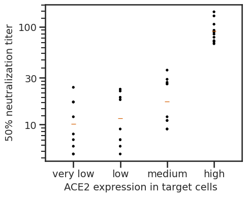

# Analysis of SARS-COV-2 virus neutalization in different Ace2 clones

This notebook analysis neutralization of SARS-COV-2/Wu-1 virus by sera from vaccinated individuals on 293T cell clones that express different levels of ACE2.

### Set up Analysis


```python
import os
import warnings

import matplotlib
import matplotlib as mpl
import matplotlib.pyplot as plt

import pandas as pd
from plotnine import *
import seaborn

import neutcurve
from neutcurve.colorschemes import CBMARKERS, CBPALETTE

import yaml
```


```python
warnings.simplefilter('ignore')
```

Read config file.


```python
with open('config.yaml') as f:
    config = yaml.safe_load(f)
```

Set seaborn theme:


```python
theme_set(theme_seaborn(style='white', context='talk', font_scale=1))
plt.style.use('seaborn-white')
```


```python
resultsdir=config['resultsdir']
os.makedirs(resultsdir, exist_ok=True)
```

## Read in data
We read in fraction infectivirty data for different cell lines and import sera information.


```python
frac_infect = list() # create df list

for f in config['depletion_neuts'].keys():
    df = (pd.read_csv(f, index_col=0))
    frac_infect.append(df)  
frac_infect = pd.concat(frac_infect)

frac_infect['serum'] = frac_infect['serum'] + '__' + frac_infect['cells']

frac_infect['virus'] = frac_infect['virus'].str.replace('post-depletion','depleted')
frac_infect['virus'] = frac_infect['virus'].str.replace('pre-depletion','not depleted')

```


```python
#read in sample info
sample_information = (pd.read_csv(config['sample_information'])
                      .drop_duplicates())

sample_information['sorted']=sample_information['subject_name'].str[:-1].astype(int)
sample_information = sample_information.sort_values('sorted')

#store sera names in a list to later convert to factors for plotting
cat_order_sera = sample_information['serum'].tolist()

```


```python
#read in ACE2 expression info
ACE2_expression_df = (pd.read_csv(config['ACE2_expression_df'])
                      .drop_duplicates())
```

## Fit Hill curve 

We use [`neutcurve`](https://jbloomlab.github.io/neutcurve/) to fit Hill curve for neutralization data and calcualte IC50 and NT50 values.


```python
fits = neutcurve.CurveFits(frac_infect, fixbottom=False)

fitparams = (
    fits.fitParams()
    .rename(columns={'virus': 'RBD-targeting antibodies'})
    [['serum', 'RBD-targeting antibodies', 'ic50', 'ic50_bound']]
    .assign(NT50=lambda x: 1/x['ic50'])

    )
```


```python
fitparams['ic50_is_bound'] = fitparams['ic50_bound'].apply(lambda x: True if x!='interpolated' else False)

```


```python
fitparams[['sample', 'cells']] = fitparams['serum'].str.split('__', 1, expand=True)
```


```python
#category for cell order so that ggplot does not use alphabetical
cat_order = ['very low', 'low', 'medium', 'high']
fitparams['cells'] = pd.Categorical(fitparams['cells'], categories=cat_order, ordered=True)

fitparams['sample'] = pd.Categorical(fitparams['sample'], categories=cat_order_sera, ordered=True)
```


```python
#save data
fitparams.to_csv(config['neuts'], index=False)
```


```python
# add % RBD-targetting antibodies
df_pre = fitparams.loc[fitparams['RBD-targeting antibodies'] == 'not depleted']
df_post = fitparams.loc[fitparams['RBD-targeting antibodies'] == 'depleted']
df_mege = pd.merge(df_pre, df_post, on="serum")
df_mege['percent_RBD'] = (df_mege['NT50_x']-df_mege['NT50_y'])/df_mege['NT50_x']*100
df_mege['percent_RBD'] = df_mege['percent_RBD'].astype(int)
fitparams = pd.merge(fitparams,df_mege[['serum','percent_RBD']],on='serum', how='left')
fitparams['percent_RBD_str'] = fitparams['percent_RBD'].astype(str) +'%'
fitparams
```


<div>
<style scoped>
    .dataframe tbody tr th:only-of-type {
        vertical-align: middle;
    }

    .dataframe tbody tr th {
        vertical-align: top;
    }

    .dataframe thead th {
        text-align: right;
    }
</style>
<table border="1" class="dataframe">
  <thead>
    <tr style="text-align: right;">
      <th></th>
      <th>serum</th>
      <th>RBD-targeting antibodies</th>
      <th>ic50</th>
      <th>ic50_bound</th>
      <th>NT50</th>
      <th>ic50_is_bound</th>
      <th>sample</th>
      <th>cells</th>
      <th>percent_RBD</th>
      <th>percent_RBD_str</th>
    </tr>
  </thead>
  <tbody>
    <tr>
      <th>0</th>
      <td>63C-day-10__very low</td>
      <td>not depleted</td>
      <td>0.000036</td>
      <td>interpolated</td>
      <td>27722.423638</td>
      <td>False</td>
      <td>63C-day-10</td>
      <td>very low</td>
      <td>95</td>
      <td>95%</td>
    </tr>
    <tr>
      <th>1</th>
      <td>63C-day-10__very low</td>
      <td>depleted</td>
      <td>0.000857</td>
      <td>interpolated</td>
      <td>1166.622681</td>
      <td>False</td>
      <td>63C-day-10</td>
      <td>very low</td>
      <td>95</td>
      <td>95%</td>
    </tr>
    <tr>
      <th>2</th>
      <td>64C-day-15__very low</td>
      <td>not depleted</td>
      <td>0.000059</td>
      <td>interpolated</td>
      <td>17037.797799</td>
      <td>False</td>
      <td>64C-day-15</td>
      <td>very low</td>
      <td>82</td>
      <td>82%</td>
    </tr>
    <tr>
      <th>3</th>
      <td>64C-day-15__very low</td>
      <td>depleted</td>
      <td>0.000341</td>
      <td>interpolated</td>
      <td>2929.899361</td>
      <td>False</td>
      <td>64C-day-15</td>
      <td>very low</td>
      <td>82</td>
      <td>82%</td>
    </tr>
    <tr>
      <th>4</th>
      <td>99C-day-27__very low</td>
      <td>not depleted</td>
      <td>0.000096</td>
      <td>interpolated</td>
      <td>10374.149491</td>
      <td>False</td>
      <td>99C-day-27</td>
      <td>very low</td>
      <td>77</td>
      <td>77%</td>
    </tr>
    <tr>
      <th>...</th>
      <td>...</td>
      <td>...</td>
      <td>...</td>
      <td>...</td>
      <td>...</td>
      <td>...</td>
      <td>...</td>
      <td>...</td>
      <td>...</td>
      <td>...</td>
    </tr>
    <tr>
      <th>59</th>
      <td>180C-day-36__high</td>
      <td>depleted</td>
      <td>0.013110</td>
      <td>interpolated</td>
      <td>76.275648</td>
      <td>False</td>
      <td>180C-day-36</td>
      <td>high</td>
      <td>98</td>
      <td>98%</td>
    </tr>
    <tr>
      <th>60</th>
      <td>215C-day-19__high</td>
      <td>not depleted</td>
      <td>0.000544</td>
      <td>interpolated</td>
      <td>1836.921925</td>
      <td>False</td>
      <td>215C-day-19</td>
      <td>high</td>
      <td>98</td>
      <td>98%</td>
    </tr>
    <tr>
      <th>61</th>
      <td>215C-day-19__high</td>
      <td>depleted</td>
      <td>0.040000</td>
      <td>lower</td>
      <td>25.000000</td>
      <td>True</td>
      <td>215C-day-19</td>
      <td>high</td>
      <td>98</td>
      <td>98%</td>
    </tr>
    <tr>
      <th>62</th>
      <td>229C-day-29__high</td>
      <td>not depleted</td>
      <td>0.000301</td>
      <td>interpolated</td>
      <td>3317.114196</td>
      <td>False</td>
      <td>229C-day-29</td>
      <td>high</td>
      <td>98</td>
      <td>98%</td>
    </tr>
    <tr>
      <th>63</th>
      <td>229C-day-29__high</td>
      <td>depleted</td>
      <td>0.015856</td>
      <td>interpolated</td>
      <td>63.068472</td>
      <td>False</td>
      <td>229C-day-29</td>
      <td>high</td>
      <td>98</td>
      <td>98%</td>
    </tr>
  </tbody>
</table>
<p>64 rows × 10 columns</p>
</div>


```python
rbd = fitparams.loc[fitparams['RBD-targeting antibodies'] == 'depleted']
```

## Plot IC50 values


```python
IC50 = (ggplot(fitparams, aes(x='cells',
                              y='ic50',
                              colour='RBD-targeting antibodies',
                              group = 'RBD-targeting antibodies',
                              )) +
              geom_point(size=3) +
              geom_line(alpha=1) +
         geom_text(rbd, aes(label = 'percent_RBD_str',
                            y=rbd['ic50'].max()*1.5),
                  colour = CBPALETTE[0]) +
             theme(figure_size=(15,1*df['serum'].nunique()),
                   axis_text=element_text(size=12),
                   axis_text_x=element_text(size=12, angle= 45),
                   legend_text=element_text(size=12),
                   legend_title=element_text(size=12),
                   axis_title_x=element_text(size=18),
                   strip_text = element_text(size=12)
                  ) +
              facet_wrap('sample', ncol = 4)+
              scale_y_log10(name='Inhibitory Concentration 50%') +
              xlab('ACE2 expression in target cells') +
             scale_color_manual(values=CBPALETTE[1:])
                 )

_ = IC50.draw()
```


    

    


## Plot NT50 values


```python
NT50 = (ggplot(fitparams, aes(x='cells', y='NT50', colour='RBD-targeting antibodies', group = 'RBD-targeting antibodies')) +
              geom_point(size=3) +
             geom_line(alpha=1) +
             geom_text(rbd, aes(label = 'percent_RBD_str',
                        y=rbd['NT50'].max()*12),
              colour = CBPALETTE[0]) +
             theme(figure_size=(15,1*df['serum'].nunique()),
                   axis_text=element_text(size=12),
                   axis_text_x=element_text(size=12, angle= 45),
                   legend_text=element_text(size=12),
                   legend_title=element_text(size=12),
                   axis_title_x=element_text(size=18),
                   strip_text = element_text(size=12)
                  ) +
                geom_hline(yintercept=config['NT50_LOD'], 
                linetype='dotted', 
                size=1, 
                alpha=0.6, 
                color=CBPALETTE[7]) +
              facet_wrap('sample', ncol = 4)+
              scale_y_log10(name='Neutralization Titer (NT50)') +
              xlab('ACE2 expression in target cells') +
             scale_color_manual(values=CBPALETTE[1:])
                 )

_ = NT50.draw()
```


    

    


## Plot neut curves for all samples


```python
fig, axes = fits.plotSera(
                          xlabel='serum dilution',
                          ncol=8,
                          widthscale=4,
                          heightscale=4,
                          titlesize=60, labelsize=50, ticksize=40, legendfontsize=50, yticklocs=[0,0.5,1],
                          markersize=10, linewidth=6,
                          virus_to_color_marker={
                          'depleted': ('#56B4E9', 'o'),
                          'not depleted': ('#E69F00', 'o')},
                          legendtitle='RBD-targeting antibodies',
                    
                         )
```


    

    


```python

```


```python

```


```python

```
