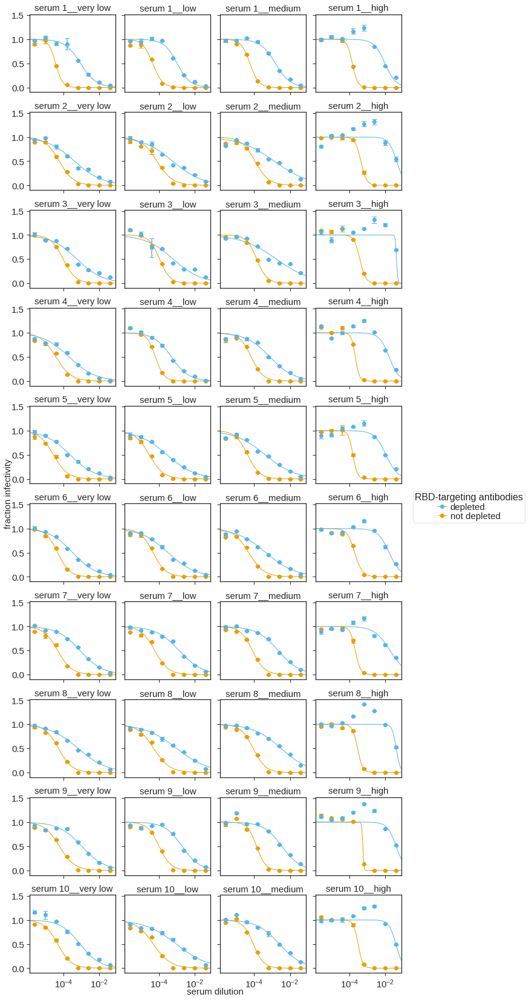

# Analysis of SARS-COV-2 virus neutalization in different Ace2 clones

This notebook analysis neutralization of SARS-COV-2/Wu-1 virus by sera from vaccinated individuals on 293T cell clones that express different levels of ACE2.

### Set up Analysis


```python
import os
import warnings

import matplotlib
import matplotlib as mpl
import matplotlib.pyplot as plt

import pandas as pd
from plotnine import *
import seaborn

import neutcurve
from neutcurve.colorschemes import CBMARKERS, CBPALETTE

import yaml
```


```python
warnings.simplefilter('ignore')
```

Read config file.


```python
with open('config.yaml') as f:
    config = yaml.safe_load(f)
```

Set seaborn theme:


```python
theme_set(theme_seaborn(style='white', context='talk', font_scale=1))
plt.style.use('seaborn-white')
```


```python
resultsdir=config['resultsdir']
os.makedirs(resultsdir, exist_ok=True)
```

## Read in data
We read in fraction infectivirty data for different cell lines and import sera information.


```python
frac_infect = list() # create df list

for f in config['depletion_neuts'].keys():
    df = (pd.read_csv(f, index_col=0))
    frac_infect.append(df)  
frac_infect = pd.concat(frac_infect)


```


```python
#read in sample info
sample_information = (pd.read_csv(config['sample_information'])
                      .drop_duplicates())

sample_information['sorted']=sample_information['subject_name'].str[:-1].astype(int)
sample_information = sample_information.sort_values('sorted')

#store sera names in a list to later convert to factors for plotting
cat_order_sera = sample_information['serum'].tolist()

```


```python
sample_information
```


<div>
<style scoped>
    .dataframe tbody tr th:only-of-type {
        vertical-align: middle;
    }

    .dataframe tbody tr th {
        vertical-align: top;
    }

    .dataframe thead th {
        text-align: right;
    }
</style>
<table border="1" class="dataframe">
  <thead>
    <tr style="text-align: right;">
      <th></th>
      <th>day</th>
      <th>age</th>
      <th>vaccine</th>
      <th>subject_name</th>
      <th>serum_org</th>
      <th>gender</th>
      <th>serum</th>
      <th>sorted</th>
    </tr>
  </thead>
  <tbody>
    <tr>
      <th>0</th>
      <td>10</td>
      <td>18-55y</td>
      <td>Pfizer</td>
      <td>63C</td>
      <td>63C-day-10</td>
      <td>Female</td>
      <td>serum 1</td>
      <td>63</td>
    </tr>
    <tr>
      <th>1</th>
      <td>15</td>
      <td>&gt;55y</td>
      <td>Pfizer</td>
      <td>64C</td>
      <td>64C-day-15</td>
      <td>Female</td>
      <td>serum 2</td>
      <td>64</td>
    </tr>
    <tr>
      <th>2</th>
      <td>27</td>
      <td>18-55y</td>
      <td>Pfizer</td>
      <td>99C</td>
      <td>99C-day-27</td>
      <td>Male</td>
      <td>serum 3</td>
      <td>99</td>
    </tr>
    <tr>
      <th>3</th>
      <td>18</td>
      <td>&gt;55y</td>
      <td>Pfizer</td>
      <td>108C</td>
      <td>108C-day-18</td>
      <td>Female</td>
      <td>serum 4</td>
      <td>108</td>
    </tr>
    <tr>
      <th>4</th>
      <td>10</td>
      <td>18-55y</td>
      <td>Pfizer</td>
      <td>120C</td>
      <td>120C-day-10</td>
      <td>Female</td>
      <td>serum 5</td>
      <td>120</td>
    </tr>
    <tr>
      <th>5</th>
      <td>36</td>
      <td>18-55y</td>
      <td>Moderna</td>
      <td>180C</td>
      <td>180C-day-36</td>
      <td>Female</td>
      <td>serum 6</td>
      <td>180</td>
    </tr>
    <tr>
      <th>6</th>
      <td>9</td>
      <td>&gt;55y</td>
      <td>Pfizer</td>
      <td>192C</td>
      <td>192C-day-9</td>
      <td>Female</td>
      <td>serum 7</td>
      <td>192</td>
    </tr>
    <tr>
      <th>7</th>
      <td>8</td>
      <td>18-55y</td>
      <td>Pfizer</td>
      <td>194C</td>
      <td>194C-day-8</td>
      <td>Male</td>
      <td>serum 8</td>
      <td>194</td>
    </tr>
    <tr>
      <th>8</th>
      <td>19</td>
      <td>18-55y</td>
      <td>Pfizer</td>
      <td>215C</td>
      <td>215C-day-19</td>
      <td>Male</td>
      <td>serum 9</td>
      <td>215</td>
    </tr>
    <tr>
      <th>9</th>
      <td>29</td>
      <td>18-55y</td>
      <td>Pfizer</td>
      <td>229C</td>
      <td>229C-day-29</td>
      <td>Female</td>
      <td>serum 10</td>
      <td>229</td>
    </tr>
  </tbody>
</table>
</div>


```python
frac_infect = pd.merge(frac_infect, sample_information,
                    left_on='serum', right_on='serum_org')
frac_infect.drop('serum_x', axis=1, inplace=True)
frac_infect = frac_infect.rename(columns={"serum_y": "serum"}, errors="raise")


```


```python
frac_infect['serum'] = frac_infect['serum'] + '__' + frac_infect['cells']

frac_infect['virus'] = frac_infect['virus'].str.replace('post-depletion','depleted')
frac_infect['virus'] = frac_infect['virus'].str.replace('pre-depletion','not depleted')

```


```python
#read in ACE2 expression info
ACE2_expression_df = (pd.read_csv(config['ACE2_expression_df'])
                      .drop_duplicates())
```

## Fit Hill curve 

We use [`neutcurve`](https://jbloomlab.github.io/neutcurve/) to fit Hill curve for neutralization data and calcualte IC50 and NT50 values.


```python
fits = neutcurve.CurveFits(frac_infect, fixbottom=0)

fitparams = (
    fits.fitParams()
    .rename(columns={'virus': 'RBD-targeting antibodies'})
    [['serum', 'RBD-targeting antibodies', 'ic50', 'ic50_bound']]
    .assign(NT50=lambda x: 1/x['ic50'])

    )
```


```python
fitparams['ic50_is_bound'] = fitparams['ic50_bound'].apply(lambda x: True if x!='interpolated' else False)

```


```python
fitparams[['sample', 'cells']] = fitparams['serum'].str.split('__', 1, expand=True)
```


```python
#category for cell order so that ggplot does not use alphabetical
cat_order = ['very low', 'low', 'medium', 'high']
fitparams['cells'] = pd.Categorical(fitparams['cells'], categories=cat_order, ordered=True)

fitparams['sample'] = pd.Categorical(fitparams['sample'], categories=cat_order_sera, ordered=True)
```


```python
#save data
fitparams.to_csv(config['neuts'], index=False)
```


```python
# add % RBD-targetting antibodies
df_pre = fitparams.loc[fitparams['RBD-targeting antibodies'] == 'not depleted']
df_post = fitparams.loc[fitparams['RBD-targeting antibodies'] == 'depleted']
df_mege = pd.merge(df_pre, df_post, on="serum")
df_mege['NT50_fc'] = df_mege['NT50_x']/df_mege['NT50_y']
df_mege['NT50_fc'] = df_mege['NT50_fc'].astype(int)
fitparams = pd.merge(fitparams,df_mege[['serum','NT50_fc']],on='serum', how='left')
fitparams['NT50_fc_str'] = fitparams['NT50_fc'].astype(str)
```


```python
NT50_fc = fitparams.loc[fitparams['RBD-targeting antibodies'] == 'depleted']
```

## Plot IC50 values


```python
IC50 = (ggplot(fitparams, aes(x='cells',
                              y='ic50',
                              colour='RBD-targeting antibodies',
                              group = 'RBD-targeting antibodies',
                              )) +
              geom_point(size=4) +
              geom_line(size = 1) +
         geom_text(NT50_fc, aes(label = 'NT50_fc_str',
                            y=NT50_fc['ic50'].max()*1.5),
                   size = 20,
                  colour = CBPALETTE[0]) +
             theme(figure_size=(25,12),
                   axis_text=element_text(size=20),
                   axis_text_x=element_text(size=16),
                   legend_text=element_text(size=20),
                   legend_title=element_text(size=20),
                   axis_title_x=element_text(size=20),
                   axis_title_y=element_text(size=20),
                   strip_text = element_text(size=20)
                  ) +
              facet_wrap('sample', ncol = 5)+
              scale_y_log10(name='Inhibitory Concentration 50%') +
              xlab('ACE2 expression in target cells') +
             scale_color_manual(values=CBPALETTE[1:])
                 )

_ = IC50.draw()
```


    

    


```python
(
    ggplot(fitparams, aes(x='cells',
                              y='NT50_fc')) +
              geom_point(size=1) +
              stat_summary(geom = "point",
                           fun_data='mean_cl_boot',
                           size=3,
                           shape = "_",
                          colour = '#D55E00')+
             theme(figure_size=(5,4),
                   axis_text=element_text(size=14),
                   axis_text_x=element_text(size=14),
                   legend_text=element_text(size=14),
                   legend_title=element_text(size=14),
                   axis_title_x=element_text(size=14),
                   axis_title_y=element_text(size=14),
                   strip_text = element_text(size=14)
                  ) +
              scale_y_log10(name='50% neutralization titer') +
              xlab('ACE2 expression in target cells') +
             scale_color_manual(values=CBPALETTE[1:])
             )
```


    

    


    <ggplot: (8780270113443)>


## Plot NT50 values


```python
NT50 = (ggplot(fitparams, aes(x='cells', y='NT50', colour='RBD-targeting antibodies', group = 'RBD-targeting antibodies')) +
              geom_point(size=4) +
              geom_line(size = 1) +
         geom_text(NT50_fc, aes(label = 'NT50_fc_str',
                            y=NT50_fc['NT50'].max()*12),
                   size = 20,
                  colour = CBPALETTE[0]) +
             theme(figure_size=(25,12),
                   axis_text=element_text(size=20),
                   axis_text_x=element_text(size=16),
                   legend_text=element_text(size=20),
                   legend_title=element_text(size=20),
                   axis_title_x=element_text(size=20),
                   axis_title_y=element_text(size=20),
                   strip_text = element_text(size=20)
                  ) +
                geom_hline(yintercept=config['NT50_LOD'], 
                linetype='dotted', 
                size=1, 
                alpha=0.6, 
                color=CBPALETTE[7]) +
              facet_wrap('sample', ncol = 5)+
              scale_y_log10(name='Neutralization Titer (NT50)') +
              xlab('ACE2 expression in target cells') +
             scale_color_manual(values=CBPALETTE[1:])
                 )

_ = NT50.draw()
```


    

    


```python
df_merged = pd.merge(fitparams, ACE2_expression_df, on='cells')
```


```python
(
    ggplot(df_merged) +
    aes(x="relative MFI", y="NT50", group='RBD-targeting antibodies', color='RBD-targeting antibodies')+
    geom_point(size=2) +
    geom_line() +
    theme(figure_size=(16,6),
          axis_ticks_minor_x=None,
          axis_text=element_text(size=14),
          axis_text_x=element_text(size=14),
          legend_text=element_text(size=14),
          legend_title=element_text(size=12),
          axis_title_x=element_text(size=18),
          strip_text = element_text(size=14)) +
    scale_color_manual(values= ['#56B4E9','#E69F00']) +
    labs(title="Neutralization Titer vs ACE2 Expression", x="ACE2 expression relative\nto highest ACE2 cells", y="Neutralization Titer (NT50)") +
    scale_x_log10() +
    scale_y_log10() +
    facet_wrap('sample', ncol=5) +
    geom_hline(yintercept=25,
                linetype='dotted', 
                size=1, 
                alpha=0.6, 
                color=CBPALETTE[7])
)
```


    

    


    <ggplot: (8780271430590)>


## Plot neut curves for all samples


```python
fig, axes = fits.plotSera(
                          xlabel='serum dilution',
                          widthscale=0.75, 
                          heightscale=1,
                          titlesize=15, 
                          labelsize=15, 
                          ticksize=15, 
                          legendfontsize=15, 
                          ncol=4,
                          virus_to_color_marker={
                          'depleted': ('#56B4E9', 'o'),
                          'not depleted': ('#E69F00', 'o')},
                          legendtitle='RBD-targeting antibodies',
                    
                         )
```


    

    


```python

```


```python

```
