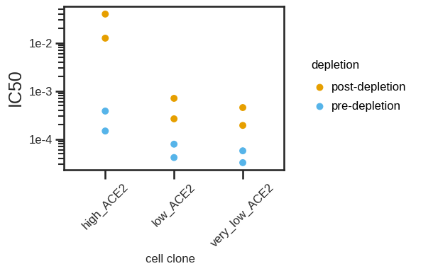
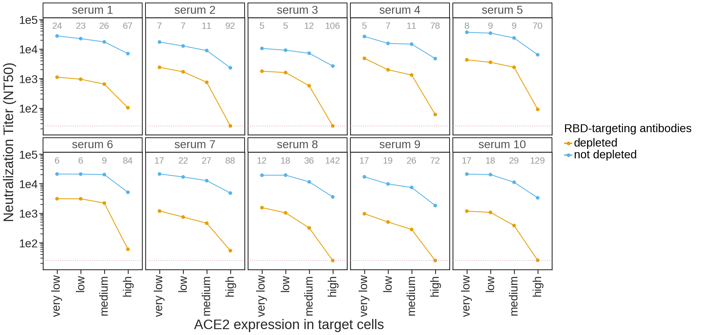
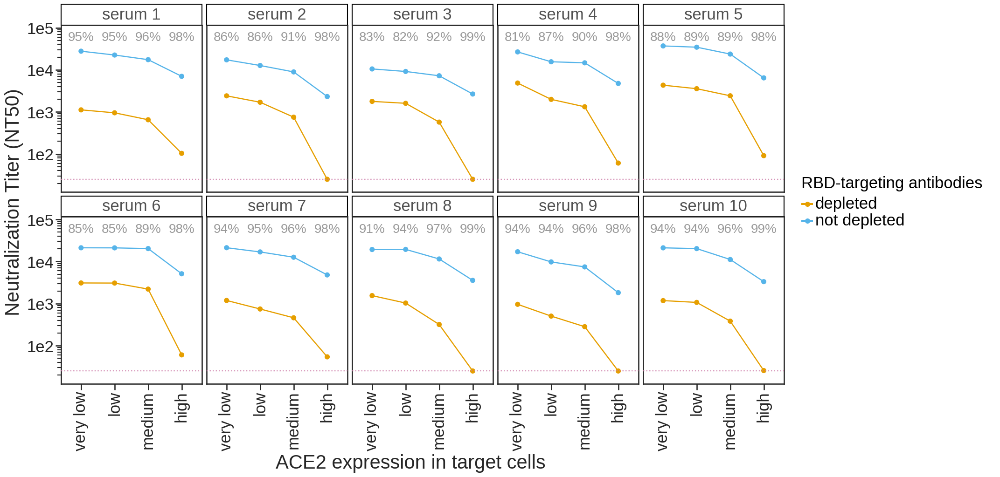
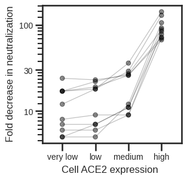
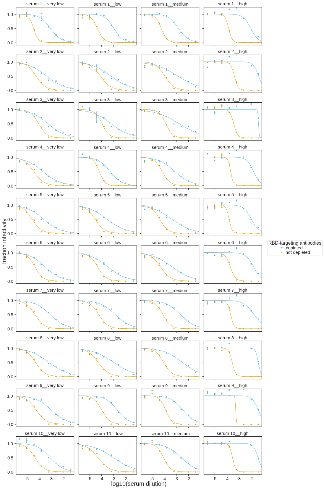
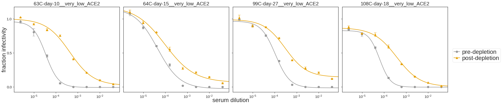
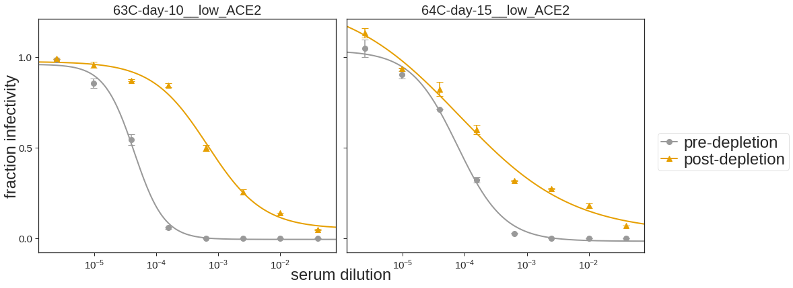
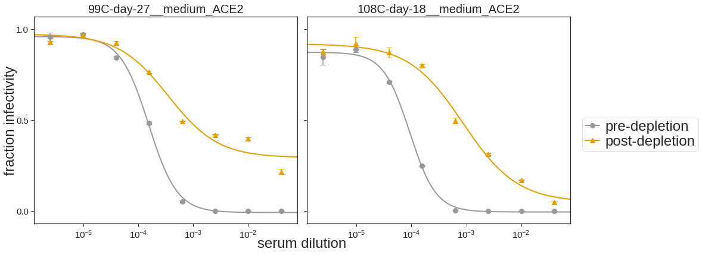

# Analysis of SARS-COV-2 virus neutalization in different Ace2 clones

### Set up Analysis


```python
import itertools
import math
import os
import re
import warnings

from IPython.display import display, HTML

import matplotlib
import matplotlib as mpl
import matplotlib.pyplot as plt
import natsort

import numpy as np
import pandas as pd
from plotnine import *
import seaborn

import neutcurve
from neutcurve.colorschemes import CBMARKERS, CBPALETTE

import yaml
```


```python
warnings.simplefilter('ignore')
```

Read config file.


```python
with open('config.yaml') as f:
    config = yaml.safe_load(f)
```

Set seaborn theme:


```python
theme_set(theme_seaborn(style='white', context='talk', font_scale=1))
plt.style.use('seaborn-white')
```


```python
resultsdir=config['resultsdir']
os.makedirs(resultsdir, exist_ok=True)
```

## Read in data


```python
sample_information = (pd.read_csv(config['sample_information'])
                      .drop_duplicates()
                     )

frac_infect = list() # create df list

for f in config['depletion_neuts'].keys():
    df = (pd.read_csv(f, index_col=0).assign(cells=config['depletion_neuts'][f]))
    df = df.merge(sample_information, on='serum')
    frac_infect.append(df)  
    
```


```python
for df in frac_infect:
    df['serum'] = df['serum'] + '__' + df['cells']
```


```python
sample_information
```


<div>
<style scoped>
    .dataframe tbody tr th:only-of-type {
        vertical-align: middle;
    }

    .dataframe tbody tr th {
        vertical-align: top;
    }

    .dataframe thead th {
        text-align: right;
    }
</style>
<table border="1" class="dataframe">
  <thead>
    <tr style="text-align: right;">
      <th></th>
      <th>day</th>
      <th>age</th>
      <th>vaccine</th>
      <th>subject_name</th>
      <th>serum</th>
      <th>gender</th>
    </tr>
  </thead>
  <tbody>
    <tr>
      <th>0</th>
      <td>9</td>
      <td>18-55y</td>
      <td>Pfizer</td>
      <td>192C</td>
      <td>192C-day-9</td>
      <td>Female</td>
    </tr>
    <tr>
      <th>1</th>
      <td>8</td>
      <td>18-55y</td>
      <td>Pfizer</td>
      <td>194C</td>
      <td>194C-day-8</td>
      <td>Male</td>
    </tr>
    <tr>
      <th>2</th>
      <td>10</td>
      <td>18-55y</td>
      <td>Pfizer</td>
      <td>63C</td>
      <td>63C-day-10</td>
      <td>Female</td>
    </tr>
    <tr>
      <th>3</th>
      <td>15</td>
      <td>&gt;55</td>
      <td>Pfizer</td>
      <td>64C</td>
      <td>64C-day-15</td>
      <td>Female</td>
    </tr>
  </tbody>
</table>
</div>


## Fit Hill curve to data using [`neutcurve`](https://jbloomlab.github.io/neutcurve/)


```python
frac_infect_combined = list()

for cells in frac_infect:
    fits = neutcurve.CurveFits(cells, fixbottom= False,fixtop = False)
    frac_infect_combined.append(fits)
```


```python
fitparams_combined = pd.DataFrame() # create empty data frame

for fits in frac_infect_combined:
    fitparams = (
        fits.fitParams()
        .rename(columns={'virus': 'depletion'})
        # get columns of interest
        [['serum', 'depletion', 'ic50', 'ic50_bound']]
        .assign(NT50=lambda x: 1/x['ic50'])
#         .merge(sample_information, on=['serum'])
        
        )
    fitparams_combined = fitparams_combined.append(fitparams).reset_index(drop=True)
    

fitparams_combined['ic50_is_bound'] = fitparams_combined['ic50_bound'].apply(lambda x: True if x!='interpolated' else False)

fitparams_combined
fitparams_combined.to_csv(config['neuts'], index=False)

```


```python
fitparams_combined
```


<div>
<style scoped>
    .dataframe tbody tr th:only-of-type {
        vertical-align: middle;
    }

    .dataframe tbody tr th {
        vertical-align: top;
    }

    .dataframe thead th {
        text-align: right;
    }
</style>
<table border="1" class="dataframe">
  <thead>
    <tr style="text-align: right;">
      <th></th>
      <th>serum</th>
      <th>depletion</th>
      <th>ic50</th>
      <th>ic50_bound</th>
      <th>NT50</th>
      <th>ic50_is_bound</th>
    </tr>
  </thead>
  <tbody>
    <tr>
      <th>0</th>
      <td>63C-day-10__very_low_ACE2</td>
      <td>pre-depletion</td>
      <td>0.000032</td>
      <td>interpolated</td>
      <td>30780.804278</td>
      <td>False</td>
    </tr>
    <tr>
      <th>1</th>
      <td>63C-day-10__very_low_ACE2</td>
      <td>post-depletion</td>
      <td>0.000454</td>
      <td>interpolated</td>
      <td>2200.668387</td>
      <td>False</td>
    </tr>
    <tr>
      <th>2</th>
      <td>64C-day-15__very_low_ACE2</td>
      <td>pre-depletion</td>
      <td>0.000057</td>
      <td>interpolated</td>
      <td>17456.245958</td>
      <td>False</td>
    </tr>
    <tr>
      <th>3</th>
      <td>64C-day-15__very_low_ACE2</td>
      <td>post-depletion</td>
      <td>0.000193</td>
      <td>interpolated</td>
      <td>5169.599503</td>
      <td>False</td>
    </tr>
    <tr>
      <th>4</th>
      <td>63C-day-10__low_ACE2</td>
      <td>pre-depletion</td>
      <td>0.000041</td>
      <td>interpolated</td>
      <td>24097.903532</td>
      <td>False</td>
    </tr>
    <tr>
      <th>5</th>
      <td>63C-day-10__low_ACE2</td>
      <td>post-depletion</td>
      <td>0.000707</td>
      <td>interpolated</td>
      <td>1413.935250</td>
      <td>False</td>
    </tr>
    <tr>
      <th>6</th>
      <td>64C-day-15__low_ACE2</td>
      <td>pre-depletion</td>
      <td>0.000079</td>
      <td>interpolated</td>
      <td>12708.732700</td>
      <td>False</td>
    </tr>
    <tr>
      <th>7</th>
      <td>64C-day-15__low_ACE2</td>
      <td>post-depletion</td>
      <td>0.000265</td>
      <td>interpolated</td>
      <td>3772.434003</td>
      <td>False</td>
    </tr>
    <tr>
      <th>8</th>
      <td>63C-day-10__high_ACE2</td>
      <td>pre-depletion</td>
      <td>0.000148</td>
      <td>interpolated</td>
      <td>6759.613871</td>
      <td>False</td>
    </tr>
    <tr>
      <th>9</th>
      <td>63C-day-10__high_ACE2</td>
      <td>post-depletion</td>
      <td>0.012612</td>
      <td>interpolated</td>
      <td>79.289795</td>
      <td>False</td>
    </tr>
    <tr>
      <th>10</th>
      <td>64C-day-15__high_ACE2</td>
      <td>pre-depletion</td>
      <td>0.000384</td>
      <td>interpolated</td>
      <td>2602.096264</td>
      <td>False</td>
    </tr>
    <tr>
      <th>11</th>
      <td>64C-day-15__high_ACE2</td>
      <td>post-depletion</td>
      <td>0.040000</td>
      <td>lower</td>
      <td>25.000000</td>
      <td>True</td>
    </tr>
  </tbody>
</table>
</div>


```python
fitparams_combined[['sample', 'cells']] = fitparams_combined['serum'].str.split('__', 1, expand=True)

```

## Plot IC50 values


```python
IC50 = (ggplot(fitparams_combined, aes(x='cells', y='ic50', colour='depletion')) +
              geom_point(size=3) +
             theme(figure_size=(4,1.5*df['serum'].nunique()),
                   axis_text=element_text(size=12),
                   axis_text_x=element_text(size=12, angle= 45),
                   legend_text=element_text(size=12),
                   legend_title=element_text(size=12),
                   axis_title_x=element_text(size=12),
                   strip_text = element_text(size=12)
                  ) +
              scale_y_log10(name='IC50') +
              xlab('cell clone') +
             scale_color_manual(values=CBPALETTE[1:])
                 )

_ = IC50.draw()
# IC50.save(f'./{resultsdir}/IC50.pdf')
```


    

    


```python
IC50 = (ggplot(fitparams_combined, aes(x='cells', y='NT50', colour='sample')) +
              geom_point(size=3) +
             theme(figure_size=(4,1.5*df['serum'].nunique()),
                   axis_text=element_text(size=12),
                   axis_text_x=element_text(size=12, angle= 45),
                   legend_text=element_text(size=12),
                   legend_title=element_text(size=12),
                   axis_title_x=element_text(size=12),
                   strip_text = element_text(size=12)
                  ) +
              scale_y_log10(name='IC50') +
              xlab('cell clone') +
             scale_color_manual(values=CBPALETTE[1:])
                 )

_ = IC50.draw()
# IC50.save(f'./{resultsdir}/IC50.pdf')
```


    

    


## IC50 fold change


```python
df_pre = fitparams_combined.loc[fitparams_combined['depletion'] == 'pre-depletion']
df_post = fitparams_combined.loc[fitparams_combined['depletion'] == 'post-depletion']
df_mege = pd.merge(df_pre, df_post, on="serum")
df_mege['IC50_fold_change'] = df_mege['ic50_x']/df_mege['ic50_y']
df_mege
```


<div>
<style scoped>
    .dataframe tbody tr th:only-of-type {
        vertical-align: middle;
    }

    .dataframe tbody tr th {
        vertical-align: top;
    }

    .dataframe thead th {
        text-align: right;
    }
</style>
<table border="1" class="dataframe">
  <thead>
    <tr style="text-align: right;">
      <th></th>
      <th>serum</th>
      <th>depletion_x</th>
      <th>ic50_x</th>
      <th>ic50_bound_x</th>
      <th>NT50_x</th>
      <th>ic50_is_bound_x</th>
      <th>sample_x</th>
      <th>cells_x</th>
      <th>depletion_y</th>
      <th>ic50_y</th>
      <th>ic50_bound_y</th>
      <th>NT50_y</th>
      <th>ic50_is_bound_y</th>
      <th>sample_y</th>
      <th>cells_y</th>
      <th>IC50_fold_change</th>
    </tr>
  </thead>
  <tbody>
    <tr>
      <th>0</th>
      <td>63C-day-10__very_low_ACE2</td>
      <td>pre-depletion</td>
      <td>0.000032</td>
      <td>interpolated</td>
      <td>30780.804278</td>
      <td>False</td>
      <td>63C-day-10</td>
      <td>very_low_ACE2</td>
      <td>post-depletion</td>
      <td>0.000454</td>
      <td>interpolated</td>
      <td>2200.668387</td>
      <td>False</td>
      <td>63C-day-10</td>
      <td>very_low_ACE2</td>
      <td>0.071495</td>
    </tr>
    <tr>
      <th>1</th>
      <td>64C-day-15__very_low_ACE2</td>
      <td>pre-depletion</td>
      <td>0.000057</td>
      <td>interpolated</td>
      <td>17456.245958</td>
      <td>False</td>
      <td>64C-day-15</td>
      <td>very_low_ACE2</td>
      <td>post-depletion</td>
      <td>0.000193</td>
      <td>interpolated</td>
      <td>5169.599503</td>
      <td>False</td>
      <td>64C-day-15</td>
      <td>very_low_ACE2</td>
      <td>0.296146</td>
    </tr>
    <tr>
      <th>2</th>
      <td>63C-day-10__low_ACE2</td>
      <td>pre-depletion</td>
      <td>0.000041</td>
      <td>interpolated</td>
      <td>24097.903532</td>
      <td>False</td>
      <td>63C-day-10</td>
      <td>low_ACE2</td>
      <td>post-depletion</td>
      <td>0.000707</td>
      <td>interpolated</td>
      <td>1413.935250</td>
      <td>False</td>
      <td>63C-day-10</td>
      <td>low_ACE2</td>
      <td>0.058675</td>
    </tr>
    <tr>
      <th>3</th>
      <td>64C-day-15__low_ACE2</td>
      <td>pre-depletion</td>
      <td>0.000079</td>
      <td>interpolated</td>
      <td>12708.732700</td>
      <td>False</td>
      <td>64C-day-15</td>
      <td>low_ACE2</td>
      <td>post-depletion</td>
      <td>0.000265</td>
      <td>interpolated</td>
      <td>3772.434003</td>
      <td>False</td>
      <td>64C-day-15</td>
      <td>low_ACE2</td>
      <td>0.296838</td>
    </tr>
    <tr>
      <th>4</th>
      <td>63C-day-10__high_ACE2</td>
      <td>pre-depletion</td>
      <td>0.000148</td>
      <td>interpolated</td>
      <td>6759.613871</td>
      <td>False</td>
      <td>63C-day-10</td>
      <td>high_ACE2</td>
      <td>post-depletion</td>
      <td>0.012612</td>
      <td>interpolated</td>
      <td>79.289795</td>
      <td>False</td>
      <td>63C-day-10</td>
      <td>high_ACE2</td>
      <td>0.011730</td>
    </tr>
    <tr>
      <th>5</th>
      <td>64C-day-15__high_ACE2</td>
      <td>pre-depletion</td>
      <td>0.000384</td>
      <td>interpolated</td>
      <td>2602.096264</td>
      <td>False</td>
      <td>64C-day-15</td>
      <td>high_ACE2</td>
      <td>post-depletion</td>
      <td>0.040000</td>
      <td>lower</td>
      <td>25.000000</td>
      <td>True</td>
      <td>64C-day-15</td>
      <td>high_ACE2</td>
      <td>0.009608</td>
    </tr>
  </tbody>
</table>
</div>


```python
IC50_fc = (ggplot(df_mege, aes(x='cells_y', y='IC50_fold_change', colour = 'sample_y')) +
              geom_point(size=3) +
             theme(figure_size=(4,1.5*df['serum'].nunique()),
                   axis_text=element_text(size=10),
                   axis_text_x=element_text(size=10),
                   legend_text=element_text(size=10),
                   legend_title=element_text(size=10),
                   axis_title_x=element_text(size=10),
                   axis_title_y=element_text(size=10),
                   strip_text = element_text(size=10)
                  ) +
              scale_y_log10(name='IC50 fold change (pre-depletion/post-depletion)') +
              xlab('cell clone') +
             scale_color_manual(values=CBPALETTE[1:])
                 )

_ = IC50_fc.draw()
# IC50.save(f'./{resultsdir}/IC50.pdf')
```


    

    


## Make horizontal line plot connecting pre- and post-IC50
* Order with greatest fold-change at the top
* Put labels on far right with the % of neutralizing activity targeting the RBD (percent_RBD = 1-(1/foldchange))
* color by pre vs post
* vertical line for limit of detection


```python
foldchange = (
    fitparams_combined
    .pivot_table(values='ic50', index=['serum'], columns=['depletion'])
    .reset_index()
    .rename(columns={'post-depletion': 'post-depletion_ic50', 'pre-depletion': 'pre-depletion_ic50'})
    .assign(fold_change=lambda x: x['post-depletion_ic50'] / x['pre-depletion_ic50'],
            percent_RBD= lambda x: ((1-1/x['fold_change'])*100).astype(int),
            NT50_pre=lambda x: 1/x['pre-depletion_ic50'],
            NT50_post=lambda x: 1/x['post-depletion_ic50'],
           )
    .merge(fitparams_combined.query('depletion=="post-depletion"')[['serum', 'ic50_is_bound']], on='serum')
    .assign(perc_RBD_str = lambda x: x['percent_RBD'].astype(str)
           )
    .rename(columns={'ic50_is_bound': 'post_ic50_bound'})
    .merge(fitparams_combined)
    )

foldchange['perc_RBD_str'] = np.where(foldchange['post_ic50_bound'], '>'+foldchange['perc_RBD_str']+'%', foldchange['perc_RBD_str']+'%')
```

### Plot fold-change NT50 pre- and post-RBD antibody depletion for the serum samples only 


```python
df=(foldchange
      .replace({'pre-depletion': 'pre', 'post-depletion': 'post'})
     )
df['fill_color'] = 'pre-depletion'
df['fill_color'] = np.where(df['depletion'] == 'post', 'post-depletion', df['fill_color'])

df['depletion']=pd.Categorical(df['depletion'], categories=['pre', 'post'], ordered=True)
```


```python
df[['serum','cells']] = df["serum"].str.split("__", n = 1, expand = True)
```


```python
p = (ggplot(df
            .assign(
                    serum=lambda x: pd.Categorical(x['serum'], natsort.natsorted(x['serum'].unique())[::-1], ordered=True)
                   )
            , 
            aes(x='NT50',
                y='serum',
                fill='depletion',
                group='serum',
                label='perc_RBD_str'
               )) +
     scale_x_log10(name='neutralization titer 50% (NT50)', 
                   limits=[config['NT50_LOD'],df['NT50'].max()*3]) +
     geom_vline(xintercept=config['NT50_LOD'], 
                linetype='dotted', 
                size=1, 
                alpha=0.6, 
                color=CBPALETTE[7]) +
     geom_line(alpha=1, color=CBPALETTE[0]) +
     geom_point(size=4, color=CBPALETTE[0]) +
     geom_text(aes(x=df['NT50'].max()*3, y='serum'),
               color=CBPALETTE[0],
               ha='right',
               size=9,
              ) +
     theme(figure_size=(15,2*df['serum'].nunique()),
           axis_text=element_text(size=12),
           legend_text=element_text(size=12),
           legend_title=element_text(size=12),
           axis_title_x=element_text(size=12),
           strip_text = element_text(size=12)
          ) +
     facet_wrap('cells') +
     ylab('') +
     scale_fill_manual(values=['#999999', '#FFFFFF', ], 
                       name='pre- or post-depletion\nof RBD antibodies')
    )

_ = p.draw()

```


    

    


```python
p = (ggplot(df
            .assign(
                    serum=lambda x: pd.Categorical(x['serum'], natsort.natsorted(x['serum'].unique())[::-1], ordered=True)
                   )
            , 
            aes(x='NT50',
                y='cells',
                fill='depletion',
                group='cells',
               )) +
     scale_x_log10(name='neutralization titer 50% (NT50)', 
                   limits=[config['NT50_LOD'],df['NT50'].max()*3]) +
     geom_vline(xintercept=config['NT50_LOD'], 
                linetype='dotted', 
                size=1, 
                alpha=0.6, 
                color=CBPALETTE[7]) +
     geom_line(alpha=1, color=CBPALETTE[0]) +
     geom_point(size=4, color=CBPALETTE[0]) +
#      geom_text(aes(x=df['NT50'].max()*3, y='serum'),
#                color=CBPALETTE[0],
#                ha='right',
#                size=9,
#               ) +
     theme(figure_size=(15,2*df['serum'].nunique()),
           axis_text=element_text(size=12),
           legend_text=element_text(size=12),
           legend_title=element_text(size=12),
           axis_title_x=element_text(size=12),
           strip_text = element_text(size=12)
          ) +
     facet_wrap('serum') +
     ylab('') +
     scale_fill_manual(values=['#999999', '#FFFFFF', ], 
                       name='pre- or post-depletion\nof RBD antibodies')
    )

_ = p.draw()

```


    

    


```python
NT50_lines = (ggplot(df, aes(x='depletion', y='NT50', group='serum')) +
              geom_point(size=2.5, alpha=0.25) +
              geom_line(alpha=0.25) +
              facet_grid('~cells', ) +
             theme(figure_size=(15,2*df['serum'].nunique()),
                   axis_text=element_text(size=12),
                   legend_text=element_text(size=12),
                   legend_title=element_text(size=12),
                   strip_text = element_text(size=12)
                  ) +
              scale_y_log10(name='neutralization titer (NT50)') +
              xlab('pre- or post-depletion\nof RBD antibodies')
                 )

_ = NT50_lines.draw()
NT50_lines.save(f'./{resultsdir}/NT50_lines.pdf')
```


    

    


```python
NT50_lines = (ggplot(df, aes(x='cells', y='NT50', colour='serum')) +
              geom_point(size=3) +
              facet_grid('~depletion', ) +
             theme(figure_size=(15,1.5*df['serum'].nunique()),
                   axis_text=element_text(size=12),
                   axis_text_x=element_text(size=12, angle= 45),
                   legend_text=element_text(size=12),
                   legend_title=element_text(size=12),
                   axis_title_x=element_text(size=12),
                   strip_text = element_text(size=12)
                  ) +
              scale_y_log10(name='neutralization titer (NT50)') +
              xlab('pre- or post-depletion\nof RBD antibodies') +
             scale_color_manual(values=CBPALETTE[1:])
                 )

_ = NT50_lines.draw()
NT50_lines.save(f'./{resultsdir}/NT50_lines.pdf')
```


    

    


## Plot neut curves for all samples


```python
for fits in frac_infect_combined:
    fig, axes = fits.plotSera(
                              xlabel='serum dilution',
                              ncol=6,
                              widthscale=2,
                              heightscale=2,
                              titlesize=20, labelsize=24, ticksize=15, legendfontsize=24, yticklocs=[0,0.5,1],
                              markersize=8, linewidth=2,
                             )
```


    

    


    

    


    

    

