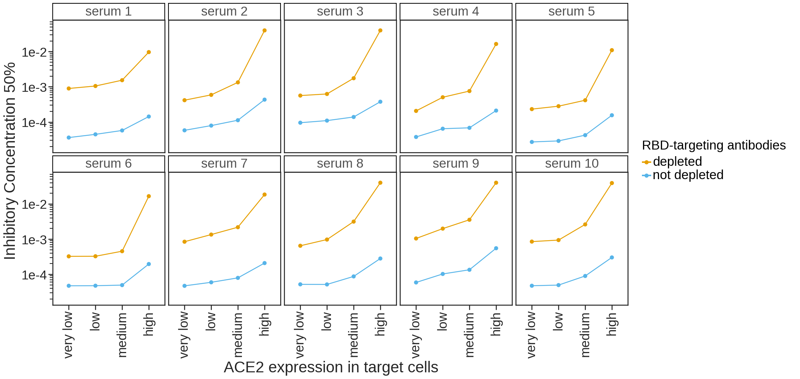

# Analysis of SARS-COV-2 virus neutalization in different Ace2 clones

### Set up Analysis


```python
import itertools
import math
import os
import re
import warnings

from IPython.display import display, HTML

import matplotlib
import matplotlib as mpl
import matplotlib.pyplot as plt
import natsort

import numpy as np
import pandas as pd
from plotnine import *
import seaborn

import neutcurve
from neutcurve.colorschemes import CBMARKERS, CBPALETTE

import yaml
```


```python
warnings.simplefilter('ignore')
```

Read config file.


```python
with open('config.yaml') as f:
    config = yaml.safe_load(f)
```

Set seaborn theme:


```python
theme_set(theme_seaborn(style='white', context='talk', font_scale=1))
plt.style.use('seaborn-white')
```


```python
resultsdir=config['resultsdir']
os.makedirs(resultsdir, exist_ok=True)
```

## Read in data


```python
sample_information = (pd.read_csv(config['sample_information'])
                      .drop_duplicates()
                     )

frac_infect = list() # create df list

for f in config['depletion_neuts'].keys():
    df = (pd.read_csv(f, index_col=0).assign(cells=config['depletion_neuts'][f]))
    df = df.merge(sample_information, on='serum')
    frac_infect.append(df)  
    
```


```python
for df in frac_infect:
    df['serum'] = df['serum'] + '__' + df['cells']
```


```python
sample_information
```


<div>
<style scoped>
    .dataframe tbody tr th:only-of-type {
        vertical-align: middle;
    }

    .dataframe tbody tr th {
        vertical-align: top;
    }

    .dataframe thead th {
        text-align: right;
    }
</style>
<table border="1" class="dataframe">
  <thead>
    <tr style="text-align: right;">
      <th></th>
      <th>day</th>
      <th>age</th>
      <th>vaccine</th>
      <th>subject_name</th>
      <th>serum</th>
      <th>gender</th>
    </tr>
  </thead>
  <tbody>
    <tr>
      <th>0</th>
      <td>9</td>
      <td>18-55y</td>
      <td>Pfizer</td>
      <td>192C</td>
      <td>192C-day-9</td>
      <td>Female</td>
    </tr>
    <tr>
      <th>1</th>
      <td>8</td>
      <td>18-55y</td>
      <td>Pfizer</td>
      <td>194C</td>
      <td>194C-day-8</td>
      <td>Male</td>
    </tr>
    <tr>
      <th>2</th>
      <td>10</td>
      <td>18-55y</td>
      <td>Pfizer</td>
      <td>63C</td>
      <td>63C-day-10</td>
      <td>Female</td>
    </tr>
    <tr>
      <th>3</th>
      <td>15</td>
      <td>&gt;55</td>
      <td>Pfizer</td>
      <td>64C</td>
      <td>64C-day-15</td>
      <td>Female</td>
    </tr>
    <tr>
      <th>4</th>
      <td>27</td>
      <td>18-55y</td>
      <td>Pfizer</td>
      <td>99C</td>
      <td>99C-day-27</td>
      <td>Male</td>
    </tr>
    <tr>
      <th>5</th>
      <td>18</td>
      <td>&gt;55</td>
      <td>Pfizer</td>
      <td>108C</td>
      <td>108C-day-18</td>
      <td>Female</td>
    </tr>
  </tbody>
</table>
</div>


## Fit Hill curve to data using [`neutcurve`](https://jbloomlab.github.io/neutcurve/)


```python
frac_infect_combined = list()

for cells in frac_infect:
    fits = neutcurve.CurveFits(cells)
    frac_infect_combined.append(fits)
```


```python
fitparams_combined = pd.DataFrame() # create empty data frame

for fits in frac_infect_combined:
    fitparams = (
        fits.fitParams()
        .rename(columns={'virus': 'depletion'})
        # get columns of interest
        [['serum', 'depletion', 'ic50', 'ic50_bound']]
        .assign(NT50=lambda x: 1/x['ic50'])
#         .merge(sample_information, on=['serum'])
        
        )
    fitparams_combined = fitparams_combined.append(fitparams).reset_index(drop=True)
    

fitparams_combined['ic50_is_bound'] = fitparams_combined['ic50_bound'].apply(lambda x: True if x!='interpolated' else False)

fitparams_combined

```


<div>
<style scoped>
    .dataframe tbody tr th:only-of-type {
        vertical-align: middle;
    }

    .dataframe tbody tr th {
        vertical-align: top;
    }

    .dataframe thead th {
        text-align: right;
    }
</style>
<table border="1" class="dataframe">
  <thead>
    <tr style="text-align: right;">
      <th></th>
      <th>serum</th>
      <th>depletion</th>
      <th>ic50</th>
      <th>ic50_bound</th>
      <th>NT50</th>
      <th>ic50_is_bound</th>
    </tr>
  </thead>
  <tbody>
    <tr>
      <th>0</th>
      <td>192C-day-9__HEK293T_Ace2_clone_A</td>
      <td>pre-depletion</td>
      <td>0.000106</td>
      <td>interpolated</td>
      <td>9469.561397</td>
      <td>False</td>
    </tr>
    <tr>
      <th>1</th>
      <td>192C-day-9__HEK293T_Ace2_clone_A</td>
      <td>post-depletion</td>
      <td>0.001138</td>
      <td>interpolated</td>
      <td>878.878272</td>
      <td>False</td>
    </tr>
    <tr>
      <th>2</th>
      <td>194C-day-8__HEK293T_Ace2_clone_A</td>
      <td>pre-depletion</td>
      <td>0.000014</td>
      <td>interpolated</td>
      <td>71600.095322</td>
      <td>False</td>
    </tr>
    <tr>
      <th>3</th>
      <td>194C-day-8__HEK293T_Ace2_clone_A</td>
      <td>post-depletion</td>
      <td>0.000062</td>
      <td>interpolated</td>
      <td>16254.673402</td>
      <td>False</td>
    </tr>
    <tr>
      <th>4</th>
      <td>63C-day-10__HEK293T_Ace2_clone_A</td>
      <td>pre-depletion</td>
      <td>0.000029</td>
      <td>interpolated</td>
      <td>34287.591298</td>
      <td>False</td>
    </tr>
    <tr>
      <th>5</th>
      <td>63C-day-10__HEK293T_Ace2_clone_A</td>
      <td>post-depletion</td>
      <td>0.000147</td>
      <td>interpolated</td>
      <td>6819.933769</td>
      <td>False</td>
    </tr>
    <tr>
      <th>6</th>
      <td>64C-day-15__HEK293T_Ace2_clone_A</td>
      <td>pre-depletion</td>
      <td>0.000011</td>
      <td>interpolated</td>
      <td>93486.983627</td>
      <td>False</td>
    </tr>
    <tr>
      <th>7</th>
      <td>64C-day-15__HEK293T_Ace2_clone_A</td>
      <td>post-depletion</td>
      <td>0.000009</td>
      <td>interpolated</td>
      <td>111127.115784</td>
      <td>False</td>
    </tr>
    <tr>
      <th>8</th>
      <td>108C-day-18__HEK293T_Ace2_clone_A</td>
      <td>pre-depletion</td>
      <td>0.000002</td>
      <td>upper</td>
      <td>409836.065574</td>
      <td>True</td>
    </tr>
    <tr>
      <th>9</th>
      <td>108C-day-18__HEK293T_Ace2_clone_A</td>
      <td>post-depletion</td>
      <td>0.000002</td>
      <td>upper</td>
      <td>409836.065574</td>
      <td>True</td>
    </tr>
    <tr>
      <th>10</th>
      <td>192C-day-9__HEK293T_Ace2_clone_C</td>
      <td>pre-depletion</td>
      <td>0.000112</td>
      <td>interpolated</td>
      <td>8966.286438</td>
      <td>False</td>
    </tr>
    <tr>
      <th>11</th>
      <td>192C-day-9__HEK293T_Ace2_clone_C</td>
      <td>post-depletion</td>
      <td>0.006997</td>
      <td>interpolated</td>
      <td>142.919038</td>
      <td>False</td>
    </tr>
    <tr>
      <th>12</th>
      <td>194C-day-8__HEK293T_Ace2_clone_C</td>
      <td>pre-depletion</td>
      <td>0.000088</td>
      <td>interpolated</td>
      <td>11393.328246</td>
      <td>False</td>
    </tr>
    <tr>
      <th>13</th>
      <td>194C-day-8__HEK293T_Ace2_clone_C</td>
      <td>post-depletion</td>
      <td>0.003657</td>
      <td>interpolated</td>
      <td>273.483223</td>
      <td>False</td>
    </tr>
    <tr>
      <th>14</th>
      <td>63C-day-10__HEK293T_Ace2_clone_C</td>
      <td>pre-depletion</td>
      <td>0.000066</td>
      <td>interpolated</td>
      <td>15258.509583</td>
      <td>False</td>
    </tr>
    <tr>
      <th>15</th>
      <td>63C-day-10__HEK293T_Ace2_clone_C</td>
      <td>post-depletion</td>
      <td>0.001420</td>
      <td>interpolated</td>
      <td>704.456627</td>
      <td>False</td>
    </tr>
    <tr>
      <th>16</th>
      <td>64C-day-15__HEK293T_Ace2_clone_C</td>
      <td>pre-depletion</td>
      <td>0.000020</td>
      <td>interpolated</td>
      <td>49091.679971</td>
      <td>False</td>
    </tr>
    <tr>
      <th>17</th>
      <td>64C-day-15__HEK293T_Ace2_clone_C</td>
      <td>post-depletion</td>
      <td>0.000140</td>
      <td>interpolated</td>
      <td>7152.623946</td>
      <td>False</td>
    </tr>
    <tr>
      <th>18</th>
      <td>108C-day-18__HEK293T_Ace2_clone_C</td>
      <td>pre-depletion</td>
      <td>0.000007</td>
      <td>interpolated</td>
      <td>143858.531956</td>
      <td>False</td>
    </tr>
    <tr>
      <th>19</th>
      <td>108C-day-18__HEK293T_Ace2_clone_C</td>
      <td>post-depletion</td>
      <td>0.000017</td>
      <td>interpolated</td>
      <td>58580.266639</td>
      <td>False</td>
    </tr>
    <tr>
      <th>20</th>
      <td>192C-day-9__HEK293T_Ace2_clone_G</td>
      <td>pre-depletion</td>
      <td>0.000112</td>
      <td>interpolated</td>
      <td>8890.238689</td>
      <td>False</td>
    </tr>
    <tr>
      <th>21</th>
      <td>192C-day-9__HEK293T_Ace2_clone_G</td>
      <td>post-depletion</td>
      <td>0.003548</td>
      <td>interpolated</td>
      <td>281.810410</td>
      <td>False</td>
    </tr>
    <tr>
      <th>22</th>
      <td>194C-day-8__HEK293T_Ace2_clone_G</td>
      <td>pre-depletion</td>
      <td>0.000049</td>
      <td>interpolated</td>
      <td>20476.449970</td>
      <td>False</td>
    </tr>
    <tr>
      <th>23</th>
      <td>194C-day-8__HEK293T_Ace2_clone_G</td>
      <td>post-depletion</td>
      <td>0.001008</td>
      <td>interpolated</td>
      <td>991.608293</td>
      <td>False</td>
    </tr>
    <tr>
      <th>24</th>
      <td>63C-day-10__HEK293T_Ace2_clone_G</td>
      <td>pre-depletion</td>
      <td>0.000050</td>
      <td>interpolated</td>
      <td>20144.740646</td>
      <td>False</td>
    </tr>
    <tr>
      <th>25</th>
      <td>63C-day-10__HEK293T_Ace2_clone_G</td>
      <td>post-depletion</td>
      <td>0.002608</td>
      <td>interpolated</td>
      <td>383.411789</td>
      <td>False</td>
    </tr>
    <tr>
      <th>26</th>
      <td>64C-day-15__HEK293T_Ace2_clone_G</td>
      <td>pre-depletion</td>
      <td>0.000068</td>
      <td>interpolated</td>
      <td>14636.294830</td>
      <td>False</td>
    </tr>
    <tr>
      <th>27</th>
      <td>64C-day-15__HEK293T_Ace2_clone_G</td>
      <td>post-depletion</td>
      <td>0.009174</td>
      <td>interpolated</td>
      <td>109.007703</td>
      <td>False</td>
    </tr>
    <tr>
      <th>28</th>
      <td>108C-day-18__HEK293T_Ace2_clone_G</td>
      <td>pre-depletion</td>
      <td>0.000031</td>
      <td>interpolated</td>
      <td>32121.620345</td>
      <td>False</td>
    </tr>
    <tr>
      <th>29</th>
      <td>108C-day-18__HEK293T_Ace2_clone_G</td>
      <td>post-depletion</td>
      <td>0.000751</td>
      <td>interpolated</td>
      <td>1331.458443</td>
      <td>False</td>
    </tr>
    <tr>
      <th>30</th>
      <td>192C-day-9__HEK293T_Ace2_consensus_Kozak</td>
      <td>pre-depletion</td>
      <td>0.000175</td>
      <td>interpolated</td>
      <td>5722.934706</td>
      <td>False</td>
    </tr>
    <tr>
      <th>31</th>
      <td>192C-day-9__HEK293T_Ace2_consensus_Kozak</td>
      <td>post-depletion</td>
      <td>0.016155</td>
      <td>interpolated</td>
      <td>61.901412</td>
      <td>False</td>
    </tr>
    <tr>
      <th>32</th>
      <td>194C-day-8__HEK293T_Ace2_consensus_Kozak</td>
      <td>pre-depletion</td>
      <td>0.000112</td>
      <td>interpolated</td>
      <td>8893.406359</td>
      <td>False</td>
    </tr>
    <tr>
      <th>33</th>
      <td>194C-day-8__HEK293T_Ace2_consensus_Kozak</td>
      <td>post-depletion</td>
      <td>0.034145</td>
      <td>interpolated</td>
      <td>29.287022</td>
      <td>False</td>
    </tr>
    <tr>
      <th>34</th>
      <td>63C-day-10__HEK293T_Ace2_consensus_Kozak</td>
      <td>pre-depletion</td>
      <td>0.000050</td>
      <td>interpolated</td>
      <td>20116.212471</td>
      <td>False</td>
    </tr>
    <tr>
      <th>35</th>
      <td>63C-day-10__HEK293T_Ace2_consensus_Kozak</td>
      <td>post-depletion</td>
      <td>0.003415</td>
      <td>interpolated</td>
      <td>292.791612</td>
      <td>False</td>
    </tr>
    <tr>
      <th>36</th>
      <td>64C-day-15__HEK293T_Ace2_consensus_Kozak</td>
      <td>pre-depletion</td>
      <td>0.000063</td>
      <td>interpolated</td>
      <td>15933.479636</td>
      <td>False</td>
    </tr>
    <tr>
      <th>37</th>
      <td>64C-day-15__HEK293T_Ace2_consensus_Kozak</td>
      <td>post-depletion</td>
      <td>0.003203</td>
      <td>interpolated</td>
      <td>312.228522</td>
      <td>False</td>
    </tr>
    <tr>
      <th>38</th>
      <td>108C-day-18__HEK293T_Ace2_consensus_Kozak</td>
      <td>pre-depletion</td>
      <td>0.000042</td>
      <td>interpolated</td>
      <td>23581.048970</td>
      <td>False</td>
    </tr>
    <tr>
      <th>39</th>
      <td>108C-day-18__HEK293T_Ace2_consensus_Kozak</td>
      <td>post-depletion</td>
      <td>0.000714</td>
      <td>interpolated</td>
      <td>1399.923027</td>
      <td>False</td>
    </tr>
  </tbody>
</table>
</div>


## Make horizontal line plot connecting pre- and post-IC50
* Order with greatest fold-change at the top
* Put labels on far right with the % of neutralizing activity targeting the RBD (percent_RBD = 1-(1/foldchange))
* color by pre vs post
* vertical line for limit of detection


```python
foldchange = (
    fitparams_combined
    .pivot_table(values='ic50', index=['serum'], columns=['depletion'])
    .reset_index()
    .rename(columns={'post-depletion': 'post-depletion_ic50', 'pre-depletion': 'pre-depletion_ic50'})
    .assign(fold_change=lambda x: x['post-depletion_ic50'] / x['pre-depletion_ic50'],
            percent_RBD= lambda x: ((1-1/x['fold_change'])*100).astype(int),
            NT50_pre=lambda x: 1/x['pre-depletion_ic50'],
            NT50_post=lambda x: 1/x['post-depletion_ic50'],
           )
    .merge(fitparams_combined.query('depletion=="post-depletion"')[['serum', 'ic50_is_bound']], on='serum')
    .assign(perc_RBD_str = lambda x: x['percent_RBD'].astype(str)
           )
    .rename(columns={'ic50_is_bound': 'post_ic50_bound'})
    .merge(fitparams_combined)
    )

foldchange['perc_RBD_str'] = np.where(foldchange['post_ic50_bound'], '>'+foldchange['perc_RBD_str']+'%', foldchange['perc_RBD_str']+'%')
```

### Plot fold-change NT50 pre- and post-RBD antibody depletion for the serum samples only 


```python
df=(foldchange
      .replace({'pre-depletion': 'pre', 'post-depletion': 'post'})
     )
df['fill_color'] = 'pre-depletion'
df['fill_color'] = np.where(df['depletion'] == 'post', 'post-depletion', df['fill_color'])

df['depletion']=pd.Categorical(df['depletion'], categories=['pre', 'post'], ordered=True)
```


```python
df[['serum','cells']] = df["serum"].str.split("__", n = 1, expand = True)
```


```python
p = (ggplot(df
            .assign(
                    serum=lambda x: pd.Categorical(x['serum'], natsort.natsorted(x['serum'].unique())[::-1], ordered=True)
                   )
            , 
            aes(x='NT50',
                y='serum',
                fill='depletion',
                group='serum',
                shape='cells',
                label='perc_RBD_str'
               )) +
     scale_x_log10(name='neutralization titer 50% (NT50)', 
                   limits=[config['NT50_LOD'],df['NT50'].max()*3]) +
     geom_vline(xintercept=config['NT50_LOD'], 
                linetype='dotted', 
                size=1, 
                alpha=0.6, 
                color=CBPALETTE[7]) +
     geom_line(alpha=1, color=CBPALETTE[0]) +
     geom_point(size=4, color=CBPALETTE[0]) +
     geom_text(aes(x=df['NT50'].max()*3, y='serum'),
               color=CBPALETTE[0],
               ha='right',
               size=9,
              ) +
     theme(figure_size=(15,2*df['serum'].nunique()),
           axis_text=element_text(size=12),
           legend_text=element_text(size=12),
           legend_title=element_text(size=12),
           axis_title_x=element_text(size=12),
           strip_text = element_text(size=12)
          ) +
     facet_wrap('cells') +
     ylab('') +
     scale_fill_manual(values=['#999999', '#FFFFFF', ], 
                       name='pre- or post-depletion\nof RBD antibodies')
    )

_ = p.draw()

```


    

    


```python
p = (ggplot(df
            .assign(
                    serum=lambda x: pd.Categorical(x['serum'], natsort.natsorted(x['serum'].unique())[::-1], ordered=True)
                   )
            , 
            aes(x='NT50',
                y='cells',
                fill='depletion',
                group='cells'
               )) +
     scale_x_log10(name='neutralization titer 50% (NT50)', 
                   limits=[config['NT50_LOD'],df['NT50'].max()*3]) +
     geom_vline(xintercept=config['NT50_LOD'], 
                linetype='dotted', 
                size=1, 
                alpha=0.6, 
                color=CBPALETTE[7]) +
     geom_line(alpha=1, color=CBPALETTE[0]) +
     geom_point(size=4, color=CBPALETTE[0]) +
#      geom_text(aes(x=df['NT50'].max()*3, y='serum'),
#                color=CBPALETTE[0],
#                ha='right',
#                size=9,
#               ) +
     theme(figure_size=(15,2*df['serum'].nunique()),
           axis_text=element_text(size=12),
           legend_text=element_text(size=12),
           legend_title=element_text(size=12),
           axis_title_x=element_text(size=12),
           strip_text = element_text(size=12)
          ) +
     facet_wrap('serum') +
     ylab('') +
     scale_fill_manual(values=['#999999', '#FFFFFF', ], 
                       name='pre- or post-depletion\nof RBD antibodies')
    )

_ = p.draw()

```


    

    


```python
NT50_lines = (ggplot(df, aes(x='depletion', y='NT50', group='serum')) +
              geom_point(size=2.5, alpha=0.25) +
              geom_line(alpha=0.25) +
              facet_grid('~cells', ) +
             theme(figure_size=(15,0.5*df['serum'].nunique()),
                   axis_text=element_text(size=12),
                   legend_text=element_text(size=12),
                   legend_title=element_text(size=12),
                   strip_text = element_text(size=12)
                  ) +
              scale_y_log10(name='neutralization titer (NT50)') +
              xlab('pre- or post-depletion\nof RBD antibodies')
                 )

_ = NT50_lines.draw()
NT50_lines.save(f'./{resultsdir}/NT50_lines.pdf')
```


    

    


```python
NT50_lines = (ggplot(df, aes(x='cells', y='NT50', colour='serum')) +
              geom_point(size=3) +
              facet_grid('~depletion', ) +
             theme(figure_size=(15,0.8*df['serum'].nunique()),
                   axis_text=element_text(size=12),
                   axis_text_x=element_text(size=12, angle= 45),
                   legend_text=element_text(size=12),
                   legend_title=element_text(size=12),
                   axis_title_x=element_text(size=12),
                   strip_text = element_text(size=12)
                  ) +
              scale_y_log10(name='neutralization titer (NT50)') +
              xlab('pre- or post-depletion\nof RBD antibodies') +
             scale_color_manual(values=CBPALETTE[1:])
                 )

_ = NT50_lines.draw()
NT50_lines.save(f'./{resultsdir}/NT50_lines.pdf')
```


    

    


## Plot neut curves for all samples


```python
for fits in frac_infect_combined:
    fig, axes = fits.plotSera(
                              xlabel='serum dilution',
                              ncol=6,
                              widthscale=2,
                              heightscale=2,
                              titlesize=20, labelsize=24, ticksize=15, legendfontsize=24, yticklocs=[0,0.5,1],
                              markersize=8, linewidth=2,
                             )
```


    

    


    

    


    

    


    

    


```python

```
