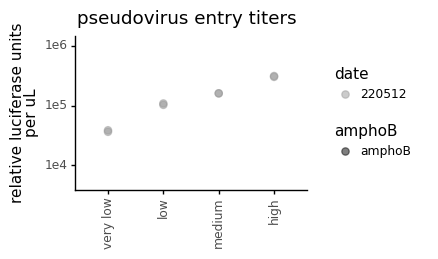

# Calculate titers of spike-pseudotyped lentiviruses on different cell lines


```python
import os
import warnings

import math
import numpy as np 

from IPython.display import display, HTML
import matplotlib.pyplot as plt

from neutcurve.colorschemes import CBMARKERS, CBPALETTE

import pandas as pd
from plotnine import *

import yaml
```


```python
warnings.simplefilter('ignore')
```

Read config


```python
with open('config.yaml') as f:
    config = yaml.safe_load(f)
```

Make output directory if needed


```python
resultsdir=config['resultsdir']
os.makedirs(resultsdir, exist_ok=True)
```


```python
titers = pd.read_csv(config['virus_titers'])

titers = (titers
          .assign(RLUperuL=lambda x: x['RLU_per_well'] / x['uL_virus'],
                  date=lambda x: x['date'].astype(str)
                 )
         )

display(HTML(titers.head().to_html(index=False)))
```


<table border="1" class="dataframe">
  <thead>
    <tr style="text-align: right;">
      <th>plasmid</th>
      <th>replicate</th>
      <th>virus</th>
      <th>dilution</th>
      <th>uL_virus</th>
      <th>RLU_per_well</th>
      <th>date</th>
      <th>cells</th>
      <th>2727_plasmid</th>
      <th>amphoB</th>
      <th>RLUperuL</th>
    </tr>
  </thead>
  <tbody>
    <tr>
      <td>2800</td>
      <td>rep1</td>
      <td>Wu_1</td>
      <td>0.50000</td>
      <td>50.000</td>
      <td>2355075</td>
      <td>220512</td>
      <td>very low</td>
      <td>6well_pooled</td>
      <td>amphoB</td>
      <td>47101.50</td>
    </tr>
    <tr>
      <td>2800</td>
      <td>rep1</td>
      <td>Wu_1</td>
      <td>0.25000</td>
      <td>25.000</td>
      <td>983529</td>
      <td>220512</td>
      <td>very low</td>
      <td>6well_pooled</td>
      <td>amphoB</td>
      <td>39341.16</td>
    </tr>
    <tr>
      <td>2800</td>
      <td>rep1</td>
      <td>Wu_1</td>
      <td>0.12500</td>
      <td>12.500</td>
      <td>414824</td>
      <td>220512</td>
      <td>very low</td>
      <td>6well_pooled</td>
      <td>amphoB</td>
      <td>33185.92</td>
    </tr>
    <tr>
      <td>2800</td>
      <td>rep1</td>
      <td>Wu_1</td>
      <td>0.06250</td>
      <td>6.250</td>
      <td>206776</td>
      <td>220512</td>
      <td>very low</td>
      <td>6well_pooled</td>
      <td>amphoB</td>
      <td>33084.16</td>
    </tr>
    <tr>
      <td>2800</td>
      <td>rep1</td>
      <td>Wu_1</td>
      <td>0.03125</td>
      <td>3.125</td>
      <td>100609</td>
      <td>220512</td>
      <td>very low</td>
      <td>6well_pooled</td>
      <td>amphoB</td>
      <td>32194.88</td>
    </tr>
  </tbody>
</table>


```python
ncol=min(8, titers['virus'].nunique())
nrow=math.ceil(titers['virus'].nunique() / ncol)

p = (ggplot(titers.dropna()
            ) +
     aes('uL_virus', 'RLU_per_well', group='replicate') +
     geom_point(size=1.5) +
     geom_line() +
     facet_wrap('~virus+date+cells+2727_plasmid+amphoB', ncol=4) +
     scale_y_log10(name='RLU per well') +
     scale_x_log10(name='uL virus per well') +
     theme_classic() +
     theme(axis_text_x=element_text(),
           figure_size=(6,3),
           )
     )

_ = p.draw()
```


    

    


```python
p = (ggplot(titers.dropna()
            ) +
     aes('uL_virus', 'RLUperuL', group='replicate') +
     geom_point(size=1.5) +
     geom_line() +
     facet_wrap('~virus+date+cells+2727_plasmid+amphoB', ncol=4) +
     scale_y_log10(name='RLU per uL') +
     scale_x_log10(name='uL virus per well') +
     theme_classic() +
     theme(axis_text_x=element_text(),
           figure_size=(5,2),
           ) 
     )

_ = p.draw()
```


    

    


From visual inspection of the above plots, it appears that only the 5 highest dilutions (i.e., >1uL of virus per well) are reliable enough to calculate titers. 


```python
#new
average_titers1 = (titers
                  .dropna() # missing values for some replicates
                  .query('uL_virus > 1') # drop lowest concentration of virus
                  .groupby(['virus', 'replicate', 'date', 'cells', '2727_plasmid', 'amphoB','dilution'])
                  .agg(mean_RLUperuL=pd.NamedAgg(column='RLUperuL', aggfunc=np.mean))
                  .reset_index()
                 )

display(HTML(average_titers1.head().to_html(index=False)))
```


<table border="1" class="dataframe">
  <thead>
    <tr style="text-align: right;">
      <th>virus</th>
      <th>replicate</th>
      <th>date</th>
      <th>cells</th>
      <th>2727_plasmid</th>
      <th>amphoB</th>
      <th>dilution</th>
      <th>mean_RLUperuL</th>
    </tr>
  </thead>
  <tbody>
    <tr>
      <td>Wu_1</td>
      <td>rep1</td>
      <td>220512</td>
      <td>high</td>
      <td>6well_pooled</td>
      <td>amphoB</td>
      <td>0.015625</td>
      <td>291884.16</td>
    </tr>
    <tr>
      <td>Wu_1</td>
      <td>rep1</td>
      <td>220512</td>
      <td>high</td>
      <td>6well_pooled</td>
      <td>amphoB</td>
      <td>0.031250</td>
      <td>327239.36</td>
    </tr>
    <tr>
      <td>Wu_1</td>
      <td>rep1</td>
      <td>220512</td>
      <td>high</td>
      <td>6well_pooled</td>
      <td>amphoB</td>
      <td>0.062500</td>
      <td>336602.24</td>
    </tr>
    <tr>
      <td>Wu_1</td>
      <td>rep1</td>
      <td>220512</td>
      <td>high</td>
      <td>6well_pooled</td>
      <td>amphoB</td>
      <td>0.125000</td>
      <td>290649.68</td>
    </tr>
    <tr>
      <td>Wu_1</td>
      <td>rep1</td>
      <td>220512</td>
      <td>high</td>
      <td>6well_pooled</td>
      <td>amphoB</td>
      <td>0.250000</td>
      <td>317654.88</td>
    </tr>
  </tbody>
</table>


```python
average_titers = (titers
                  .dropna() # missing values for some replicates
                  .query('uL_virus > 1') # drop lowest concentration of virus
                  .groupby(['virus', 'replicate', 'date', 'cells', '2727_plasmid', 'amphoB'])
                  .agg(mean_RLUperuL=pd.NamedAgg(column='RLUperuL', aggfunc=np.mean))
                  .reset_index()
                 )

display(HTML(average_titers.head().to_html(index=False)))
```


<table border="1" class="dataframe">
  <thead>
    <tr style="text-align: right;">
      <th>virus</th>
      <th>replicate</th>
      <th>date</th>
      <th>cells</th>
      <th>2727_plasmid</th>
      <th>amphoB</th>
      <th>mean_RLUperuL</th>
    </tr>
  </thead>
  <tbody>
    <tr>
      <td>Wu_1</td>
      <td>rep1</td>
      <td>220512</td>
      <td>high</td>
      <td>6well_pooled</td>
      <td>amphoB</td>
      <td>312806.064000</td>
    </tr>
    <tr>
      <td>Wu_1</td>
      <td>rep1</td>
      <td>220512</td>
      <td>low</td>
      <td>6well_pooled</td>
      <td>amphoB</td>
      <td>102924.786667</td>
    </tr>
    <tr>
      <td>Wu_1</td>
      <td>rep1</td>
      <td>220512</td>
      <td>medium</td>
      <td>6well_pooled</td>
      <td>amphoB</td>
      <td>160672.613333</td>
    </tr>
    <tr>
      <td>Wu_1</td>
      <td>rep1</td>
      <td>220512</td>
      <td>very low</td>
      <td>6well_pooled</td>
      <td>amphoB</td>
      <td>36438.630000</td>
    </tr>
    <tr>
      <td>Wu_1</td>
      <td>rep2</td>
      <td>220512</td>
      <td>high</td>
      <td>6well_pooled</td>
      <td>amphoB</td>
      <td>302495.504000</td>
    </tr>
  </tbody>
</table>


```python
cat_order = ['very low', 'low', 'medium', 'high']
average_titers['cells'] = pd.Categorical(average_titers['cells'], categories=cat_order, ordered=True)

average_titers
```


<div>
<style scoped>
    .dataframe tbody tr th:only-of-type {
        vertical-align: middle;
    }

    .dataframe tbody tr th {
        vertical-align: top;
    }

    .dataframe thead th {
        text-align: right;
    }
</style>
<table border="1" class="dataframe">
  <thead>
    <tr style="text-align: right;">
      <th></th>
      <th>virus</th>
      <th>replicate</th>
      <th>date</th>
      <th>cells</th>
      <th>2727_plasmid</th>
      <th>amphoB</th>
      <th>mean_RLUperuL</th>
    </tr>
  </thead>
  <tbody>
    <tr>
      <th>0</th>
      <td>Wu_1</td>
      <td>rep1</td>
      <td>220512</td>
      <td>high</td>
      <td>6well_pooled</td>
      <td>amphoB</td>
      <td>312806.064000</td>
    </tr>
    <tr>
      <th>1</th>
      <td>Wu_1</td>
      <td>rep1</td>
      <td>220512</td>
      <td>low</td>
      <td>6well_pooled</td>
      <td>amphoB</td>
      <td>102924.786667</td>
    </tr>
    <tr>
      <th>2</th>
      <td>Wu_1</td>
      <td>rep1</td>
      <td>220512</td>
      <td>medium</td>
      <td>6well_pooled</td>
      <td>amphoB</td>
      <td>160672.613333</td>
    </tr>
    <tr>
      <th>3</th>
      <td>Wu_1</td>
      <td>rep1</td>
      <td>220512</td>
      <td>very low</td>
      <td>6well_pooled</td>
      <td>amphoB</td>
      <td>36438.630000</td>
    </tr>
    <tr>
      <th>4</th>
      <td>Wu_1</td>
      <td>rep2</td>
      <td>220512</td>
      <td>high</td>
      <td>6well_pooled</td>
      <td>amphoB</td>
      <td>302495.504000</td>
    </tr>
    <tr>
      <th>5</th>
      <td>Wu_1</td>
      <td>rep2</td>
      <td>220512</td>
      <td>low</td>
      <td>6well_pooled</td>
      <td>amphoB</td>
      <td>108748.243333</td>
    </tr>
    <tr>
      <th>6</th>
      <td>Wu_1</td>
      <td>rep2</td>
      <td>220512</td>
      <td>medium</td>
      <td>6well_pooled</td>
      <td>amphoB</td>
      <td>160088.590000</td>
    </tr>
    <tr>
      <th>7</th>
      <td>Wu_1</td>
      <td>rep2</td>
      <td>220512</td>
      <td>very low</td>
      <td>6well_pooled</td>
      <td>amphoB</td>
      <td>38693.633333</td>
    </tr>
  </tbody>
</table>
</div>


```python
p = (ggplot(average_titers, 
            aes(x='cells', y='mean_RLUperuL', color='date', shape = 'amphoB')
           ) +
     geom_point(size=2.5, alpha=0.5)+
     theme_classic() +
     theme(axis_text_x=element_text(angle=90, vjust=1, hjust=0.5),
           figure_size=(average_titers['virus'].nunique()*3,2),
           axis_title_x=element_blank(),
          ) +
     scale_y_log10(limits=[5e3,1.1e6]) +
     ylab('relative luciferase units\nper uL')+
     labs(title='pseudovirus entry titers') +
     scale_color_manual(values=CBPALETTE)
    )

_ = p.draw()
```


    

    


Calculate how much virus to use in neut assays:


```python
target_RLU = 2e5
uL_virus_per_well = 50

dilute_virus = (average_titers
                .groupby(['virus', 'date', 'cells', '2727_plasmid','amphoB'])
                .agg(RLUperuL=pd.NamedAgg(column='mean_RLUperuL', aggfunc=np.mean))
                .reset_index()
                .assign(target_RLU = target_RLU,
                        uL_virus_per_well = uL_virus_per_well,
                        dilution_factor = lambda x: x['RLUperuL']/target_RLU*uL_virus_per_well,
                        uL_per_8mL = lambda x: 8000/x['dilution_factor'],
                        media_for_8ml = lambda x: 8000 - 8000/x['dilution_factor']
                       )
               )


titerfile = os.path.join(resultsdir, 'virus_titers.csv')
print(f"Saving to {titerfile}")

dilute_virus.to_csv(titerfile, index=False)

display(HTML(dilute_virus.to_html(index=False)))
```

    Saving to results/virus_titers.csv


<table border="1" class="dataframe">
  <thead>
    <tr style="text-align: right;">
      <th>virus</th>
      <th>date</th>
      <th>cells</th>
      <th>2727_plasmid</th>
      <th>amphoB</th>
      <th>RLUperuL</th>
      <th>target_RLU</th>
      <th>uL_virus_per_well</th>
      <th>dilution_factor</th>
      <th>uL_per_8mL</th>
      <th>media_for_8ml</th>
    </tr>
  </thead>
  <tbody>
    <tr>
      <td>Wu_1</td>
      <td>220512</td>
      <td>very low</td>
      <td>6well_pooled</td>
      <td>amphoB</td>
      <td>37566.131667</td>
      <td>200000.0</td>
      <td>50</td>
      <td>9.391533</td>
      <td>851.831120</td>
      <td>7148.168880</td>
    </tr>
    <tr>
      <td>Wu_1</td>
      <td>220512</td>
      <td>low</td>
      <td>6well_pooled</td>
      <td>amphoB</td>
      <td>105836.515000</td>
      <td>200000.0</td>
      <td>50</td>
      <td>26.459129</td>
      <td>302.353115</td>
      <td>7697.646885</td>
    </tr>
    <tr>
      <td>Wu_1</td>
      <td>220512</td>
      <td>medium</td>
      <td>6well_pooled</td>
      <td>amphoB</td>
      <td>160380.601667</td>
      <td>200000.0</td>
      <td>50</td>
      <td>40.095150</td>
      <td>199.525377</td>
      <td>7800.474623</td>
    </tr>
    <tr>
      <td>Wu_1</td>
      <td>220512</td>
      <td>high</td>
      <td>6well_pooled</td>
      <td>amphoB</td>
      <td>307650.784000</td>
      <td>200000.0</td>
      <td>50</td>
      <td>76.912696</td>
      <td>104.014037</td>
      <td>7895.985963</td>
    </tr>
  </tbody>
</table>

