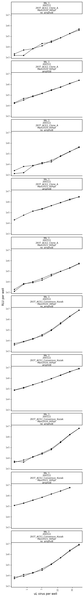
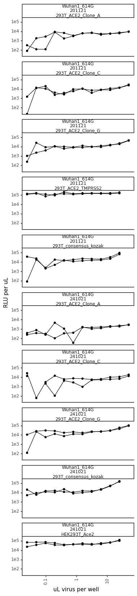
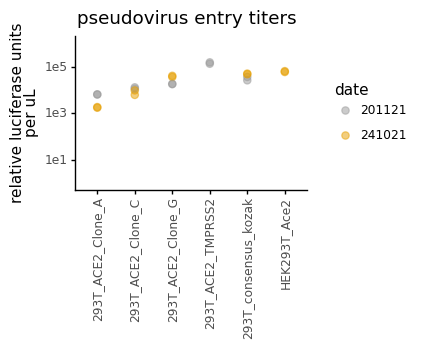

# Calculate titers of spike-pseudotyped lentiviruses on different cell lines


```python
import os
import warnings

import math
import numpy as np 

from IPython.display import display, HTML
import matplotlib.pyplot as plt

from neutcurve.colorschemes import CBMARKERS, CBPALETTE

import pandas as pd
from plotnine import *

import yaml
```


```python
warnings.simplefilter('ignore')
```

Read config


```python
with open('config.yaml') as f:
    config = yaml.safe_load(f)
```

Make output directory if needed


```python
resultsdir=config['resultsdir']
os.makedirs(resultsdir, exist_ok=True)
```


```python
titers = pd.read_csv(config['virus_titers'])

titers = (titers
          .assign(RLUperuL=lambda x: x['RLU_per_well'] / x['uL_virus'],
                  date=lambda x: x['date'].astype(str)
                 )
         )

display(HTML(titers.head().to_html(index=False)))
```


<table border="1" class="dataframe">
  <thead>
    <tr style="text-align: right;">
      <th>plasmid</th>
      <th>replicate</th>
      <th>virus</th>
      <th>dilution</th>
      <th>uL_virus</th>
      <th>RLU_per_well</th>
      <th>date</th>
      <th>cells</th>
      <th>RLUperuL</th>
    </tr>
  </thead>
  <tbody>
    <tr>
      <td>2800</td>
      <td>rep1</td>
      <td>Wuhan1_614G</td>
      <td>0.250000</td>
      <td>25.0000</td>
      <td>4085192</td>
      <td>241021</td>
      <td>293T_consensus_kozak</td>
      <td>163407.68</td>
    </tr>
    <tr>
      <td>2800</td>
      <td>rep1</td>
      <td>Wuhan1_614G</td>
      <td>0.125000</td>
      <td>12.5000</td>
      <td>613486</td>
      <td>241021</td>
      <td>293T_consensus_kozak</td>
      <td>49078.88</td>
    </tr>
    <tr>
      <td>2800</td>
      <td>rep1</td>
      <td>Wuhan1_614G</td>
      <td>0.062500</td>
      <td>6.2500</td>
      <td>128746</td>
      <td>241021</td>
      <td>293T_consensus_kozak</td>
      <td>20599.36</td>
    </tr>
    <tr>
      <td>2800</td>
      <td>rep1</td>
      <td>Wuhan1_614G</td>
      <td>0.031250</td>
      <td>3.1250</td>
      <td>45646</td>
      <td>241021</td>
      <td>293T_consensus_kozak</td>
      <td>14606.72</td>
    </tr>
    <tr>
      <td>2800</td>
      <td>rep1</td>
      <td>Wuhan1_614G</td>
      <td>0.015625</td>
      <td>1.5625</td>
      <td>24070</td>
      <td>241021</td>
      <td>293T_consensus_kozak</td>
      <td>15404.80</td>
    </tr>
  </tbody>
</table>


```python
ncol=min(8, titers['virus'].nunique())
nrow=math.ceil(titers['virus'].nunique() / ncol)

p = (ggplot(titers.dropna()
            ) +
     aes('uL_virus', 'RLU_per_well', group='replicate') +
     geom_point(size=1.5) +
     geom_line() +
     facet_wrap('~virus+date+cells', ncol=ncol) +
     scale_y_log10(name='RLU per well') +
     scale_x_log10(name='uL virus per well') +
     theme_classic() +
     theme(axis_text_x=element_text(angle=90),
           figure_size=(5 * ncol, 20 * nrow),
           )
     )

_ = p.draw()
```


    

    


```python
p = (ggplot(titers.dropna()
            ) +
     aes('uL_virus', 'RLUperuL', group='replicate') +
     geom_point(size=1.5) +
     geom_line() +
     facet_wrap('~virus+date+cells', ncol=ncol) +
     scale_y_log10(name='RLU per uL') +
     scale_x_log10(name='uL virus per well') +
     theme_classic() +
     theme(axis_text_x=element_text(angle=90),
           figure_size=(4 * ncol, 20 * nrow),
           ) 
     )

_ = p.draw()
```


    

    


From visual inspection of the above plots, it appears that only the 5 highest dilutions (i.e., >1uL of virus per well) are reliable enough to calculate titers. 


```python
average_titers = (titers
                  .dropna() # missing values for some replicates
                  .query('uL_virus > 1') # drop lowest concentration of virus
                  .groupby(['virus', 'replicate', 'date', 'cells'])
                  .agg(mean_RLUperuL=pd.NamedAgg(column='RLUperuL', aggfunc=np.mean))
                  .reset_index()
                 )

display(HTML(average_titers.head().to_html(index=False)))
```


<table border="1" class="dataframe">
  <thead>
    <tr style="text-align: right;">
      <th>virus</th>
      <th>replicate</th>
      <th>date</th>
      <th>cells</th>
      <th>mean_RLUperuL</th>
    </tr>
  </thead>
  <tbody>
    <tr>
      <td>Wuhan1_614G</td>
      <td>rep1</td>
      <td>201121</td>
      <td>293T_ACE2_Clone_A</td>
      <td>6617.546667</td>
    </tr>
    <tr>
      <td>Wuhan1_614G</td>
      <td>rep1</td>
      <td>201121</td>
      <td>293T_ACE2_Clone_C</td>
      <td>13435.146667</td>
    </tr>
    <tr>
      <td>Wuhan1_614G</td>
      <td>rep1</td>
      <td>201121</td>
      <td>293T_ACE2_Clone_G</td>
      <td>18858.410000</td>
    </tr>
    <tr>
      <td>Wuhan1_614G</td>
      <td>rep1</td>
      <td>201121</td>
      <td>293T_ACE2_TMPRSS2</td>
      <td>160942.064000</td>
    </tr>
    <tr>
      <td>Wuhan1_614G</td>
      <td>rep1</td>
      <td>201121</td>
      <td>293T_consensus_kozak</td>
      <td>37778.880000</td>
    </tr>
  </tbody>
</table>


```python
p = (ggplot(average_titers, 
            aes(x='cells', y='mean_RLUperuL', color='date')
           ) +
     geom_point(size=2.5, alpha=0.5)+
     theme_classic() +
     theme(axis_text_x=element_text(angle=90, vjust=1, hjust=0.5),
           figure_size=(average_titers['virus'].nunique()*3,2),
           axis_title_x=element_blank(),
          ) +
     scale_y_log10(limits=[1,1.1e6]) +
     ylab('relative luciferase units\nper uL')+
     labs(title='pseudovirus entry titers') +
     scale_color_manual(values=CBPALETTE)
    )

_ = p.draw()
```


    

    


Calculate how much virus to use in neut assays:


```python
target_RLU = 2e5
uL_virus_per_well = 50

dilute_virus = (average_titers
                .groupby(['virus', 'date', 'cells'])
                .agg(RLUperuL=pd.NamedAgg(column='mean_RLUperuL', aggfunc=np.mean))
                .reset_index()
                .assign(target_RLU = target_RLU,
                        uL_virus_per_well = uL_virus_per_well,
                        dilution_factor = lambda x: x['RLUperuL']/target_RLU*uL_virus_per_well,
                        uL_per_8mL = lambda x: 8000/x['dilution_factor'],
                        media_for_8ml = lambda x: 8000 - 8000/x['dilution_factor']
                       )
               )


titerfile = os.path.join(resultsdir, 'virus_titers.csv')
print(f"Saving to {titerfile}")

dilute_virus.to_csv(titerfile, index=False)

display(HTML(dilute_virus.to_html(index=False)))
```

    Saving to results/virus_titers.csv


<table border="1" class="dataframe">
  <thead>
    <tr style="text-align: right;">
      <th>virus</th>
      <th>date</th>
      <th>cells</th>
      <th>RLUperuL</th>
      <th>target_RLU</th>
      <th>uL_virus_per_well</th>
      <th>dilution_factor</th>
      <th>uL_per_8mL</th>
      <th>media_for_8ml</th>
    </tr>
  </thead>
  <tbody>
    <tr>
      <td>Wuhan1_614G</td>
      <td>201121</td>
      <td>293T_ACE2_Clone_A</td>
      <td>6633.666667</td>
      <td>200000.0</td>
      <td>50</td>
      <td>1.658417</td>
      <td>4823.878197</td>
      <td>3176.121803</td>
    </tr>
    <tr>
      <td>Wuhan1_614G</td>
      <td>201121</td>
      <td>293T_ACE2_Clone_C</td>
      <td>12514.403333</td>
      <td>200000.0</td>
      <td>50</td>
      <td>3.128601</td>
      <td>2557.053592</td>
      <td>5442.946408</td>
    </tr>
    <tr>
      <td>Wuhan1_614G</td>
      <td>201121</td>
      <td>293T_ACE2_Clone_G</td>
      <td>18691.020000</td>
      <td>200000.0</td>
      <td>50</td>
      <td>4.672755</td>
      <td>1712.052098</td>
      <td>6287.947902</td>
    </tr>
    <tr>
      <td>Wuhan1_614G</td>
      <td>201121</td>
      <td>293T_ACE2_TMPRSS2</td>
      <td>150397.364000</td>
      <td>200000.0</td>
      <td>50</td>
      <td>37.599341</td>
      <td>212.769687</td>
      <td>7787.230313</td>
    </tr>
    <tr>
      <td>Wuhan1_614G</td>
      <td>201121</td>
      <td>293T_consensus_kozak</td>
      <td>32359.316000</td>
      <td>200000.0</td>
      <td>50</td>
      <td>8.089829</td>
      <td>988.896057</td>
      <td>7011.103943</td>
    </tr>
    <tr>
      <td>Wuhan1_614G</td>
      <td>241021</td>
      <td>293T_ACE2_Clone_A</td>
      <td>1830.921667</td>
      <td>200000.0</td>
      <td>50</td>
      <td>0.457730</td>
      <td>17477.536359</td>
      <td>-9477.536359</td>
    </tr>
    <tr>
      <td>Wuhan1_614G</td>
      <td>241021</td>
      <td>293T_ACE2_Clone_C</td>
      <td>8123.145000</td>
      <td>200000.0</td>
      <td>50</td>
      <td>2.030786</td>
      <td>3939.360925</td>
      <td>4060.639075</td>
    </tr>
    <tr>
      <td>Wuhan1_614G</td>
      <td>241021</td>
      <td>293T_ACE2_Clone_G</td>
      <td>39923.311667</td>
      <td>200000.0</td>
      <td>50</td>
      <td>9.980828</td>
      <td>801.536713</td>
      <td>7198.463287</td>
    </tr>
    <tr>
      <td>Wuhan1_614G</td>
      <td>241021</td>
      <td>293T_consensus_kozak</td>
      <td>50877.348000</td>
      <td>200000.0</td>
      <td>50</td>
      <td>12.719337</td>
      <td>628.963601</td>
      <td>7371.036399</td>
    </tr>
    <tr>
      <td>Wuhan1_614G</td>
      <td>241021</td>
      <td>HEK293T_Ace2</td>
      <td>64376.044000</td>
      <td>200000.0</td>
      <td>50</td>
      <td>16.094011</td>
      <td>497.079317</td>
      <td>7502.920683</td>
    </tr>
  </tbody>
</table>


```python
# !jupyter nbconvert calculate_titer.ipynb --to HTML
```


```python

```
